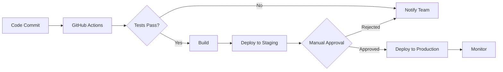

# Implementation Roadmap - StationeryChain Frontend

**Version:** 1.0  
**Last Updated:** February 15, 2026  
**Duration:** 16 Weeks  
**Team Size:** 3-4 Frontend Developers

---

## Table of Contents

1. [Overview](#overview)
2. [Project Phases](#project-phases)
3. [Week-by-Week Breakdown](#week-by-week-breakdown)
4. [Resource Allocation](#resource-allocation)
5. [Dependencies & Risks](#dependencies--risks)
6. [Quality Gates](#quality-gates)
7. [Deployment Strategy](#deployment-strategy)

---

## 1. Overview

This roadmap outlines the 16-week implementation plan for the StationeryChain frontend application. The project is divided into 4 phases, each with specific deliverables and milestones.

### Project Goals

1. Build a production-ready Next.js 14 application
2. Implement all user interfaces for 4 user roles
3. Integrate with 55+ backend APIs
4. Implement AI-powered autonomous replenishment features
5. Create developer tools for agent monitoring
6. Achieve 90%+ test coverage
7. Deploy to production with CI/CD pipeline

### Tech Stack

- **Framework:** Next.js 14 (App Router)
- **Language:** TypeScript
- **Styling:** Tailwind CSS
- **UI Components:** shadcn/ui
- **State Management:** Zustand
- **Server State:** TanStack Query (React Query)
- **Forms:** React Hook Form + Zod
- **Charts:** Recharts
- **Testing:** Jest + React Testing Library + Playwright
- **CI/CD:** GitHub Actions
- **Deployment:** Vercel

---

## 2. Project Phases

### Phase 1: Foundation (Weeks 1-4)
**Goal:** Setup project infrastructure and core authentication

**Deliverables:**
- Project setup with Next.js 14
- Design system implementation
- Authentication system
- Core layout components
- API integration layer

---

### Phase 2: Core Features (Weeks 5-10)
**Goal:** Implement main business features for all user roles

**Deliverables:**
- Admin dashboard and management screens
- Warehouse management features
- Procurement officer workflows
- Supplier portal
- Data tables and forms

---

### Phase 3: Advanced Features (Weeks 11-14)
**Goal:** Implement AI features and developer tools

**Deliverables:**
- Autonomous replenishment system
- Agent activity monitoring
- Real-time notifications
- Advanced analytics
- Cost optimization tools

---

### Phase 4: Polish & Launch (Weeks 15-16)
**Goal:** Testing, optimization, and production deployment

**Deliverables:**
- Comprehensive testing
- Performance optimization
- Documentation
- Production deployment
- User training materials

---

## 3. Week-by-Week Breakdown

### **PHASE 1: FOUNDATION**

---

#### **Week 1: Project Setup & Design System**

**Sprint Goal:** Initialize project and establish design foundation

**Tasks:**

**Day 1-2: Project Initialization**
- [ ] Create Next.js 14 project with TypeScript
  ```bash
  npx create-next-app@latest stationery-chain --typescript --tailwind --app
  ```
- [ ] Setup project structure (folders: app, components, lib, hooks, types)
- [ ] Configure Tailwind CSS with custom theme
- [ ] Install and configure ESLint + Prettier
- [ ] Setup Git repository and branching strategy
- [ ] Configure VS Code workspace settings

**Day 3-4: Design System Setup**
- [ ] Install shadcn/ui and configure
  ```bash
  npx shadcn-ui@latest init
  ```
- [ ] Install all required shadcn components (40+ components)
- [ ] Setup global CSS variables for design tokens
- [ ] Create color palette (primary, secondary, status colors)
- [ ] Configure typography system
- [ ] Setup Lucide React icons

**Day 5: Testing Infrastructure**
- [ ] Setup Jest for unit testing
- [ ] Configure React Testing Library
- [ ] Setup Playwright for E2E tests
- [ ] Create test utilities and helpers
- [ ] Write sample tests to verify setup

**Deliverables:**
- ✅ Working Next.js 14 project
- ✅ Complete design system with 40+ components
- ✅ Testing infrastructure ready
- ✅ Git repository with CI/CD pipeline (basic)

**Team Allocation:**
- Developer 1: Project setup, Tailwind config
- Developer 2: shadcn/ui installation, design tokens
- Developer 3: Testing infrastructure, CI/CD

---

#### **Week 2: Core Layout & Navigation**

**Sprint Goal:** Build reusable layout components

**Tasks:**

**Day 1-2: Layout Components**
- [ ] Create `RootLayout` with global styles
- [ ] Build `Navbar` component
  - Logo
  - Global search bar
  - Notifications dropdown
  - User menu
- [ ] Build `Sidebar` component
  - Navigation menu with icons
  - Collapsible functionality
  - Active state highlighting
  - Role-based menu items
- [ ] Create `PageHeader` component
  - Breadcrumbs
  - Back button
  - Action buttons

**Day 3: Responsive Navigation**
- [ ] Implement mobile sidebar (Sheet component)
- [ ] Add responsive breakpoints
- [ ] Create bottom navigation for mobile (optional)
- [ ] Test navigation on different screen sizes

**Day 4-5: Common Components**
- [ ] Create `StatCard` component
- [ ] Create `StatusBadge` component
- [ ] Create `EmptyState` component
- [ ] Create `SearchBar` component
- [ ] Create `DataTable` wrapper component
- [ ] Write unit tests for all components

**Deliverables:**
- ✅ Complete layout system (Navbar, Sidebar, PageHeader)
- ✅ 10+ business-specific components
- ✅ Responsive design working on mobile/tablet/desktop
- ✅ Component tests with 80%+ coverage

**Team Allocation:**
- Developer 1: Navbar, Sidebar
- Developer 2: PageHeader, mobile navigation
- Developer 3: Business components, tests

---

#### **Week 3: Authentication System**

**Sprint Goal:** Implement complete authentication flow

**Tasks:**

**Day 1-2: API Integration Layer**
- [ ] Setup Axios instance with interceptors
- [ ] Create API client (`lib/api/client.ts`)
- [ ] Implement request/response interceptors
- [ ] Add token refresh logic
- [ ] Create API error handling
- [ ] Setup API types (`types/api.ts`)

**Day 3: Authentication Pages**
- [ ] Create Login page (`app/(auth)/login/page.tsx`)
  - Email/password form with Zod validation
  - Remember me checkbox
  - Forgot password link
  - Error handling
- [ ] Create Signup page (`app/(auth)/signup/page.tsx`)
  - Registration form with validation
  - Password strength indicator
  - Terms & conditions checkbox
- [ ] Create Forgot Password page

**Day 4: Auth State Management**
- [ ] Setup Zustand auth store (`stores/authStore.ts`)
- [ ] Implement login/logout actions
- [ ] Implement token storage (localStorage/cookies)
- [ ] Create auth hooks (`useAuth`, `useUser`)
- [ ] Add protected route middleware

**Day 5: Testing & Integration**
- [ ] Test authentication flow end-to-end
- [ ] Implement token refresh on 401 errors
- [ ] Test protected routes
- [ ] Write E2E tests with Playwright
- [ ] Add loading states and error handling

**Deliverables:**
- ✅ Complete authentication system
- ✅ Login, Signup, Forgot Password pages
- ✅ Protected routes middleware
- ✅ Token refresh mechanism
- ✅ E2E authentication tests

**Team Allocation:**
- Developer 1: API client, interceptors
- Developer 2: Auth pages, forms
- Developer 3: Auth store, middleware, tests

---

#### **Week 4: State Management & Data Fetching**

**Sprint Goal:** Setup state management and API integration patterns

**Tasks:**

**Day 1-2: Zustand Stores**
- [ ] Create store structure (`stores/`)
- [ ] Implement `authStore.ts`
- [ ] Implement `uiStore.ts` (modals, sidebar, theme)
- [ ] Implement `notificationStore.ts`
- [ ] Create store types
- [ ] Add store persistence (zustand/persist)

**Day 3: React Query Setup**
- [ ] Setup TanStack Query provider
- [ ] Configure query client with defaults
- [ ] Create query hooks pattern (`hooks/queries/`)
- [ ] Implement `useProducts` query hook
- [ ] Implement `useUsers` query hook
- [ ] Add query caching strategy

**Day 4: Mutation Hooks**
- [ ] Create mutation hooks pattern (`hooks/mutations/`)
- [ ] Implement `useCreateProduct` mutation
- [ ] Implement `useUpdateProduct` mutation
- [ ] Implement `useDeleteProduct` mutation
- [ ] Add optimistic updates
- [ ] Add error handling with toasts

**Day 5: API Services**
- [ ] Create service layer (`lib/api/services/`)
- [ ] Implement `productService.ts`
- [ ] Implement `userService.ts`
- [ ] Implement `warehouseService.ts`
- [ ] Add JSDoc documentation
- [ ] Write integration tests

**Deliverables:**
- ✅ Complete state management setup (Zustand)
- ✅ React Query configured with caching
- ✅ Reusable query/mutation hooks pattern
- ✅ API service layer
- ✅ Integration tests

**Team Allocation:**
- Developer 1: Zustand stores
- Developer 2: React Query setup, query hooks
- Developer 3: Mutation hooks, service layer

---

### **PHASE 2: CORE FEATURES**

---

#### **Week 5: Admin Dashboard**

**Sprint Goal:** Build admin dashboard with key metrics

**Tasks:**

**Day 1-2: Dashboard Layout**
- [ ] Create admin dashboard page (`app/(dashboard)/admin/page.tsx`)
- [ ] Implement stat cards (Total Products, Users, Warehouses, Suppliers)
- [ ] Create activity feed component
- [ ] Add system health metrics card
- [ ] Fetch dashboard data using React Query

**Day 3: Charts & Visualizations**
- [ ] Install Recharts library
- [ ] Create `LineChart` component for inventory trends
- [ ] Create `BarChart` component for spending
- [ ] Create `PieChart` component for categories
- [ ] Make charts responsive

**Day 4: Alerts & Notifications**
- [ ] Create low stock alerts component
- [ ] Implement notification dropdown
- [ ] Add real-time notification polling
- [ ] Create notification badge counter
- [ ] Link notifications to relevant pages

**Day 5: Testing & Refinement**
- [ ] Write component tests
- [ ] Test responsive layout
- [ ] Add loading skeletons
- [ ] Optimize performance
- [ ] Add error boundaries

**Deliverables:**
- ✅ Complete admin dashboard
- ✅ 4 stat cards with live data
- ✅ 3+ chart visualizations
- ✅ Real-time notifications
- ✅ Responsive design

**Team Allocation:**
- Developer 1: Dashboard layout, stat cards
- Developer 2: Charts and visualizations
- Developer 3: Notifications, tests

---

#### **Week 6: Product Management**

**Sprint Goal:** Implement complete product CRUD

**Tasks:**

**Day 1-2: Product List Page**
- [ ] Create product list page (`app/(dashboard)/admin/products/page.tsx`)
- [ ] Implement advanced DataTable with sorting, filtering, pagination
- [ ] Add search functionality
- [ ] Add category/status filters
- [ ] Implement bulk actions (delete, export)
- [ ] Add grid/list view toggle

**Day 3: Product Forms**
- [ ] Create Add Product modal/page
- [ ] Implement product form with React Hook Form + Zod
- [ ] Add image upload functionality
- [ ] Create Edit Product flow
- [ ] Add form validation with error messages

**Day 4: Product Details**
- [ ] Create product detail page
- [ ] Show complete product information
- [ ] Display inventory across warehouses
- [ ] Show product history/activity log
- [ ] Add quick actions (edit, delete, duplicate)

**Day 5: Testing & Polish**
- [ ] Test CRUD operations end-to-end
- [ ] Write unit tests for forms
- [ ] Test bulk operations
- [ ] Add optimistic updates
- [ ] Implement undo functionality for deletes

**Deliverables:**
- ✅ Product list with advanced table
- ✅ Complete CRUD operations
- ✅ Product form with validation
- ✅ Image upload functionality
- ✅ Bulk operations

**Team Allocation:**
- Developer 1: Product list, DataTable
- Developer 2: Product forms, validation
- Developer 3: Product details, tests

---

#### **Week 7: User & Warehouse Management**

**Sprint Goal:** Build user and warehouse management

**Tasks:**

**Day 1-2: User Management**
- [ ] Create user list page (`app/(dashboard)/admin/users/page.tsx`)
- [ ] Implement user DataTable
- [ ] Create Add/Edit User modal
- [ ] Add role-based access control
- [ ] Implement user activation/deactivation
- [ ] Add password reset functionality

**Day 3-4: Warehouse Management**
- [ ] Create warehouse list page (`app/(dashboard)/admin/warehouses/page.tsx`)
- [ ] Implement warehouse DataTable
- [ ] Create Add/Edit Warehouse form
- [ ] Add zone management within warehouse
- [ ] Display capacity utilization
- [ ] Create warehouse detail page with stats

**Day 5: Testing**
- [ ] Test user CRUD operations
- [ ] Test warehouse CRUD operations
- [ ] Test role-based access
- [ ] Write E2E tests
- [ ] Add error handling

**Deliverables:**
- ✅ User management system
- ✅ Warehouse management system
- ✅ Zone management
- ✅ Role-based access control
- ✅ Tests with 85%+ coverage

**Team Allocation:**
- Developer 1: User management
- Developer 2: Warehouse management
- Developer 3: Zone management, tests

---

#### **Week 8: Supplier Management**

**Sprint Goal:** Build supplier portal and management

**Tasks:**

**Day 1-2: Supplier List & CRUD**
- [ ] Create supplier list page (`app/(dashboard)/admin/suppliers/page.tsx`)
- [ ] Implement supplier DataTable
- [ ] Create Add/Edit Supplier form
- [ ] Add supplier approval workflow
- [ ] Implement supplier rating system

**Day 3: Supplier Detail Page**
- [ ] Create supplier detail page
- [ ] Display supplier information
- [ ] Show product catalog
- [ ] Display order history
- [ ] Show performance metrics
- [ ] Add contract management

**Day 4: Supplier Portal**
- [ ] Create supplier dashboard (`app/(dashboard)/supplier/page.tsx`)
- [ ] Show pending orders
- [ ] Display performance metrics
- [ ] Add revenue charts

**Day 5: Testing & Integration**
- [ ] Test supplier CRUD
- [ ] Test approval workflow
- [ ] Test supplier portal
- [ ] Write E2E tests
- [ ] Add integration tests

**Deliverables:**
- ✅ Supplier management system
- ✅ Supplier detail pages
- ✅ Supplier portal
- ✅ Approval workflow
- ✅ Performance metrics

**Team Allocation:**
- Developer 1: Supplier list, CRUD
- Developer 2: Supplier detail page
- Developer 3: Supplier portal, tests

---

#### **Week 9: Warehouse Manager Features**

**Sprint Goal:** Build warehouse manager workflows

**Tasks:**

**Day 1-2: Warehouse Dashboard**
- [ ] Create warehouse manager dashboard (`app/(dashboard)/warehouse/page.tsx`)
- [ ] Display inventory metrics
- [ ] Show today's tasks checklist
- [ ] Add alerts and notifications
- [ ] Display zone status visualization

**Day 3: Inventory Management**
- [ ] Create inventory list page (`app/(dashboard)/warehouse/inventory/page.tsx`)
- [ ] Implement inventory DataTable
- [ ] Add stock adjustment modal
- [ ] Implement stock movement tracking
- [ ] Add zone transfer functionality

**Day 4: Receiving (GRN)**
- [ ] Create receiving page (`app/(dashboard)/warehouse/receiving/page.tsx`)
- [ ] Display pending POs
- [ ] Create GRN form for receiving goods
- [ ] Add quality check fields
- [ ] Implement photo upload for damages

**Day 5: Stock Transfers**
- [ ] Create stock transfer page
- [ ] Display transfer list
- [ ] Create transfer form
- [ ] Add transfer tracking
- [ ] Write tests

**Deliverables:**
- ✅ Warehouse manager dashboard
- ✅ Inventory management
- ✅ Receiving (GRN) system
- ✅ Stock transfer functionality
- ✅ Zone management

**Team Allocation:**
- Developer 1: Warehouse dashboard
- Developer 2: Inventory management, adjustments
- Developer 3: Receiving, transfers, tests

---

#### **Week 10: Procurement Features**

**Sprint Goal:** Build procurement officer workflows

**Tasks:**

**Day 1-2: Procurement Dashboard**
- [ ] Create procurement dashboard (`app/(dashboard)/procurement/page.tsx`)
- [ ] Display PO metrics
- [ ] Show pending actions
- [ ] Add spending analysis charts
- [ ] Display PO pipeline visualization

**Day 3-4: Purchase Orders**
- [ ] Create PO list page (`app/(dashboard)/procurement/purchase-orders/page.tsx`)
- [ ] Implement PO DataTable with filters
- [ ] Create PO form with line items
- [ ] Add PO approval workflow
- [ ] Implement PO status tracking

**Day 5: Cost Analysis**
- [ ] Create cost analysis page
- [ ] Display spending trends
- [ ] Show category breakdown
- [ ] Add supplier comparison
- [ ] Implement cost optimization insights
- [ ] Write tests

**Deliverables:**
- ✅ Procurement dashboard
- ✅ Purchase order system
- ✅ PO approval workflow
- ✅ Cost analysis tools
- ✅ Spending visualizations

**Team Allocation:**
- Developer 1: Procurement dashboard
- Developer 2: Purchase orders, workflow
- Developer 3: Cost analysis, tests

---

### **PHASE 3: ADVANCED FEATURES**

---

#### **Week 11: Autonomous Replenishment System**

**Sprint Goal:** Implement AI-powered replenishment

**Tasks:**

**Day 1-2: Replenishment Dashboard**
- [ ] Create autonomous replenishment page (`app/(dashboard)/procurement/autonomous-replenishment/page.tsx`)
- [ ] Display AI insights summary
- [ ] Show recommendation cards
- [ ] Add confidence score visualization
- [ ] Implement filter/sort functionality

**Day 3: Recommendation Cards**
- [ ] Create detailed recommendation component
- [ ] Display demand forecast chart
- [ ] Show supplier comparison
- [ ] Add approve/reject actions
- [ ] Implement edit recommendation modal

**Day 4: Bulk Actions**
- [ ] Implement select all functionality
- [ ] Add bulk approve/reject
- [ ] Create combined PO generation
- [ ] Display total value calculation
- [ ] Add estimated savings

**Day 5: Integration & Testing**
- [ ] Connect to AI recommendation API
- [ ] Test approval workflow
- [ ] Test PO generation
- [ ] Write E2E tests
- [ ] Add error handling

**Deliverables:**
- ✅ Autonomous replenishment system
- ✅ AI recommendation UI
- ✅ Demand forecasting visualization
- ✅ Bulk approval workflow
- ✅ PO auto-generation

**Team Allocation:**
- Developer 1: Replenishment dashboard, API integration
- Developer 2: Recommendation cards, actions
- Developer 3: Bulk operations, tests

---

#### **Week 12: Agent Activity Monitor**

**Sprint Goal:** Build developer tools for agent monitoring

**Tasks:**

**Day 1-2: Agent Monitor Dashboard**
- [ ] Create agent monitor page (`app/(dashboard)/dev-tools/agent-monitor/page.tsx`)
- [ ] Display current stage/progress
- [ ] Show agent pipeline visualization
- [ ] Implement real-time activity log
- [ ] Add auto-refresh functionality

**Day 3: Activity Log Details**
- [ ] Create expandable log entry component
- [ ] Display tool call details (request/response)
- [ ] Show agent reasoning/thoughts
- [ ] Add metadata (timestamp, duration, status)
- [ ] Implement related logs linking

**Day 4: Tool Statistics**
- [ ] Create tool call statistics table
- [ ] Display success rates
- [ ] Show average execution time
- [ ] Add error tracking
- [ ] Implement time-range filters

**Day 5: Testing & Polish**
- [ ] Test real-time updates
- [ ] Test log search/filter
- [ ] Add export logs functionality
- [ ] Write tests
- [ ] Optimize performance

**Deliverables:**
- ✅ Agent activity monitor
- ✅ Real-time activity log
- ✅ Tool call details viewer
- ✅ Performance statistics
- ✅ Export functionality

**Team Allocation:**
- Developer 1: Monitor dashboard, real-time updates
- Developer 2: Log details, tool stats
- Developer 3: Search/filter, export, tests

---

#### **Week 13: System Logs & Decision Visualizer**

**Sprint Goal:** Complete developer tools suite

**Tasks:**

**Day 1-2: System Logs Page**
- [ ] Create system logs page (`app/(dashboard)/dev-tools/logs/page.tsx`)
- [ ] Implement log table with filters
- [ ] Add log level filtering
- [ ] Create expandable log details
- [ ] Add stack trace viewer
- [ ] Implement related logs functionality

**Day 3-4: Decision Tree Visualizer**
- [ ] Create decision tree page (`app/(dashboard)/dev-tools/decision-tree/page.tsx`)
- [ ] Implement interactive flow diagram
- [ ] Add node click functionality
- [ ] Display decision logic
- [ ] Show input/output data
- [ ] Add execution time tracking

**Day 5: Performance Dashboard**
- [ ] Create performance dashboard
- [ ] Display session metrics
- [ ] Show agent breakdown
- [ ] Add error analysis
- [ ] Implement time-series charts
- [ ] Write tests

**Deliverables:**
- ✅ System logs viewer
- ✅ Decision tree visualizer
- ✅ Performance dashboard
- ✅ Error tracking
- ✅ Complete dev tools suite

**Team Allocation:**
- Developer 1: System logs
- Developer 2: Decision tree visualizer
- Developer 3: Performance dashboard, tests

---

#### **Week 14: Real-time Features & Notifications**

**Sprint Goal:** Implement real-time updates

**Tasks:**

**Day 1-2: WebSocket Integration**
- [ ] Setup WebSocket connection
- [ ] Implement connection handling
- [ ] Add reconnection logic
- [ ] Create WebSocket hooks
- [ ] Add event listeners

**Day 3: Real-time Notifications**
- [ ] Implement real-time notification system
- [ ] Add notification toast on events
- [ ] Update notification badge in real-time
- [ ] Add sound notifications (optional)
- [ ] Implement notification preferences

**Day 4: Real-time Data Updates**
- [ ] Add real-time inventory updates
- [ ] Implement real-time PO status updates
- [ ] Add real-time agent activity updates
- [ ] Update dashboard metrics in real-time
- [ ] Implement optimistic updates

**Day 5: Testing**
- [ ] Test WebSocket connections
- [ ] Test reconnection logic
- [ ] Test real-time updates
- [ ] Write E2E tests
- [ ] Load test with multiple users

**Deliverables:**
- ✅ WebSocket integration
- ✅ Real-time notifications
- ✅ Real-time data updates
- ✅ Notification preferences
- ✅ Connection handling

**Team Allocation:**
- Developer 1: WebSocket setup, connection handling
- Developer 2: Real-time notifications
- Developer 3: Real-time data updates, tests

---

### **PHASE 4: POLISH & LAUNCH**

---

#### **Week 15: Testing & Quality Assurance**

**Sprint Goal:** Comprehensive testing and bug fixes

**Tasks:**

**Day 1: Unit Testing**
- [ ] Achieve 90%+ unit test coverage
- [ ] Test all hooks and utilities
- [ ] Test all stores
- [ ] Test all components
- [ ] Fix failing tests

**Day 2: Integration Testing**
- [ ] Test API integrations
- [ ] Test authentication flow
- [ ] Test CRUD operations
- [ ] Test state management
- [ ] Test data fetching

**Day 3: E2E Testing**
- [ ] Write Playwright tests for critical flows:
  - [ ] Login/logout
  - [ ] Product CRUD
  - [ ] PO creation and approval
  - [ ] Inventory management
  - [ ] Autonomous replenishment
- [ ] Test across different browsers
- [ ] Test responsive design

**Day 4: Accessibility Testing**
- [ ] Run Lighthouse accessibility audit
- [ ] Test keyboard navigation
- [ ] Test screen reader compatibility
- [ ] Fix accessibility issues
- [ ] Achieve WCAG 2.1 AA compliance

**Day 5: Bug Fixes**
- [ ] Review and prioritize bugs
- [ ] Fix critical bugs
- [ ] Fix high-priority bugs
- [ ] Retest fixed issues
- [ ] Update documentation

**Deliverables:**
- ✅ 90%+ test coverage
- ✅ Comprehensive E2E test suite
- ✅ WCAG 2.1 AA compliant
- ✅ Zero critical bugs
- ✅ All tests passing

**Team Allocation:**
- Developer 1: Unit tests
- Developer 2: Integration and E2E tests
- Developer 3: Accessibility testing, bug fixes

---

#### **Week 16: Performance Optimization & Deployment**

**Sprint Goal:** Optimize and deploy to production

**Tasks:**

**Day 1: Performance Optimization**
- [ ] Run Lighthouse performance audit
- [ ] Optimize images (use Next.js Image)
- [ ] Implement code splitting
- [ ] Add lazy loading for heavy components
- [ ] Optimize bundle size
- [ ] Add caching strategies
- [ ] Implement service worker (PWA)

**Day 2: Production Setup**
- [ ] Setup production environment variables
- [ ] Configure production API endpoints
- [ ] Setup error tracking (Sentry)
- [ ] Setup analytics (Google Analytics/Mixpanel)
- [ ] Configure CDN
- [ ] Setup monitoring (Vercel Analytics)

**Day 3: CI/CD & Deployment**
- [ ] Setup GitHub Actions for CI/CD
- [ ] Configure automated testing pipeline
- [ ] Setup staging environment
- [ ] Deploy to staging
- [ ] Setup production deployment
- [ ] Configure domain and SSL

**Day 4: Documentation**
- [ ] Update README with setup instructions
- [ ] Document environment variables
- [ ] Create deployment guide
- [ ] Document API integration
- [ ] Create user guide
- [ ] Add inline code documentation

**Day 5: Launch Preparation**
- [ ] Final QA on staging
- [ ] Performance testing
- [ ] Security audit
- [ ] Backup database
- [ ] Deploy to production
- [ ] Monitor for issues
- [ ] Create launch announcement

**Deliverables:**
- ✅ Optimized performance (90+ Lighthouse score)
- ✅ Production deployment
- ✅ CI/CD pipeline
- ✅ Complete documentation
- ✅ Monitoring and analytics
- ✅ Live application

**Team Allocation:**
- Developer 1: Performance optimization
- Developer 2: CI/CD setup, deployment
- Developer 3: Documentation, QA

---

## 4. Resource Allocation

### Team Structure

**Team Size:** 3-4 Frontend Developers

**Roles:**
- **Lead Developer (1):** Architecture, code review, critical features
- **Senior Developer (1-2):** Complex features, state management, testing
- **Mid-level Developer (1):** UI components, integration, bug fixes

### Time Commitment

- **Total Duration:** 16 weeks (4 months)
- **Sprint Length:** 1 week
- **Daily Standup:** 15 minutes
- **Sprint Planning:** 2 hours (Monday)
- **Sprint Review:** 1 hour (Friday)
- **Sprint Retrospective:** 1 hour (Friday)

### Skill Requirements

**Required Skills:**
- React/Next.js expertise
- TypeScript proficiency
- Tailwind CSS experience
- State management (Zustand/Redux)
- Testing (Jest, React Testing Library, Playwright)
- API integration
- Git workflow

**Nice to Have:**
- WebSocket experience
- Chart libraries (Recharts)
- Performance optimization
- Accessibility (a11y) knowledge
- CI/CD experience

---

## 5. Dependencies & Risks

### External Dependencies

1. **Backend API Availability**
   - Risk: Backend APIs not ready
   - Mitigation: Use mock data, API mocks with MSW

2. **Design Assets**
   - Risk: Designs not finalized
   - Mitigation: Start with wireframes, iterate with design team

3. **Third-party Services**
   - Risk: Service downtime (Vercel, Sentry, etc.)
   - Mitigation: Have backup plans, local development environment

### Technical Risks

1. **Performance Issues**
   - Risk: Slow page loads, large bundle size
   - Mitigation: Regular performance audits, code splitting, lazy loading

2. **Browser Compatibility**
   - Risk: Features not working in older browsers
   - Mitigation: Test on multiple browsers, use polyfills

3. **State Management Complexity**
   - Risk: Complex state leading to bugs
   - Mitigation: Well-defined store structure, thorough testing

4. **Real-time Features**
   - Risk: WebSocket connection issues
   - Mitigation: Implement robust reconnection logic, fallback to polling

### Project Risks

1. **Scope Creep**
   - Risk: Additional features requested mid-project
   - Mitigation: Strict change management process, prioritization

2. **Resource Availability**
   - Risk: Team members unavailable
   - Mitigation: Knowledge sharing, documentation, backup resources

3. **Timeline Pressure**
   - Risk: Delays in critical path
   - Mitigation: Buffer time built into roadmap, regular progress tracking

---

## 6. Quality Gates

Each phase must pass these quality gates before moving to the next:

### Phase 1: Foundation
- [ ] All tests passing (unit + integration)
- [ ] Code review completed
- [ ] Authentication working end-to-end
- [ ] Responsive design verified
- [ ] Performance: Lighthouse score > 80

### Phase 2: Core Features
- [ ] All CRUD operations working
- [ ] Test coverage > 85%
- [ ] All user roles implemented
- [ ] Data tables with sorting/filtering working
- [ ] Forms with validation working
- [ ] Performance: Lighthouse score > 85

### Phase 3: Advanced Features
- [ ] AI recommendations working
- [ ] Developer tools functional
- [ ] Real-time features working
- [ ] WebSocket connections stable
- [ ] Test coverage > 90%
- [ ] Performance: Lighthouse score > 90

### Phase 4: Launch
- [ ] All tests passing (unit + integration + E2E)
- [ ] Test coverage > 90%
- [ ] WCAG 2.1 AA compliant
- [ ] Zero critical bugs
- [ ] Performance: Lighthouse score > 95
- [ ] Production deployment successful
- [ ] Monitoring and analytics configured

---

## 7. Deployment Strategy

### Environments

1. **Development**
   - Local development machines
   - Hot reload enabled
   - Mock data available

2. **Staging**
   - Vercel preview deployments
   - Connected to staging backend
   - Used for QA and testing

3. **Production**
   - Vercel production deployment
   - Connected to production backend
   - Monitored 24/7

### Deployment Process



### Rollback Strategy

1. **Vercel Instant Rollback**
   - One-click rollback to previous deployment
   - Takes < 1 minute

2. **Git Revert**
   - Revert commits causing issues
   - Redeploy from stable commit

3. **Feature Flags**
   - Disable problematic features without redeployment
   - Gradual rollout of new features

---

## 8. Success Metrics

### Technical Metrics

- **Performance:**
  - Lighthouse score > 95
  - First Contentful Paint < 1.5s
  - Time to Interactive < 3s
  - Bundle size < 250KB (gzipped)

- **Quality:**
  - Test coverage > 90%
  - Zero critical bugs
  - < 5 high-priority bugs
  - WCAG 2.1 AA compliant

- **Reliability:**
  - 99.9% uptime
  - < 1% error rate
  - < 500ms API response time

### Business Metrics

- **User Adoption:**
  - 100% of users successfully onboarded
  - < 5% support tickets
  - > 80% user satisfaction

- **Efficiency:**
  - 50% reduction in manual replenishment time
  - 30% improvement in PO creation time
  - 40% reduction in inventory errors

---

## 9. Post-Launch Activities

### Week 17-18: Stabilization

- [ ] Monitor production for issues
- [ ] Fix bugs reported by users
- [ ] Optimize based on real usage data
- [ ] Gather user feedback
- [ ] Create improvement backlog

### Week 19-20: Iteration

- [ ] Implement quick wins from feedback
- [ ] Add minor enhancements
- [ ] Improve performance further
- [ ] Update documentation
- [ ] Plan next phase features

---

## Summary

This 16-week implementation roadmap provides a structured approach to building the StationeryChain frontend application. The project is divided into 4 phases:

1. **Foundation (4 weeks):** Setup, design system, authentication, state management
2. **Core Features (6 weeks):** All user dashboards and CRUD operations
3. **Advanced Features (4 weeks):** AI features, developer tools, real-time updates
4. **Polish & Launch (2 weeks):** Testing, optimization, deployment

**Key Success Factors:**
- ✅ Clear weekly goals and deliverables
- ✅ Regular quality gates
- ✅ Comprehensive testing strategy
- ✅ Risk mitigation plans
- ✅ Performance-first approach
- ✅ Strong documentation

**Expected Outcome:**
A production-ready, performant, accessible, and well-tested Next.js application that serves 4 user roles with 50+ screens, 40+ components, and 55+ API integrations.

---

**Next Steps:**
1. Review and approve roadmap
2. Assemble team
3. Setup development environment
4. Start Week 1: Project Setup & Design System
