# Architecture Diagrams

Full visual architecture of the StationeryChain supply chain system — all components, connections, agent workflows, and data flows.

---

## 1. System Overview

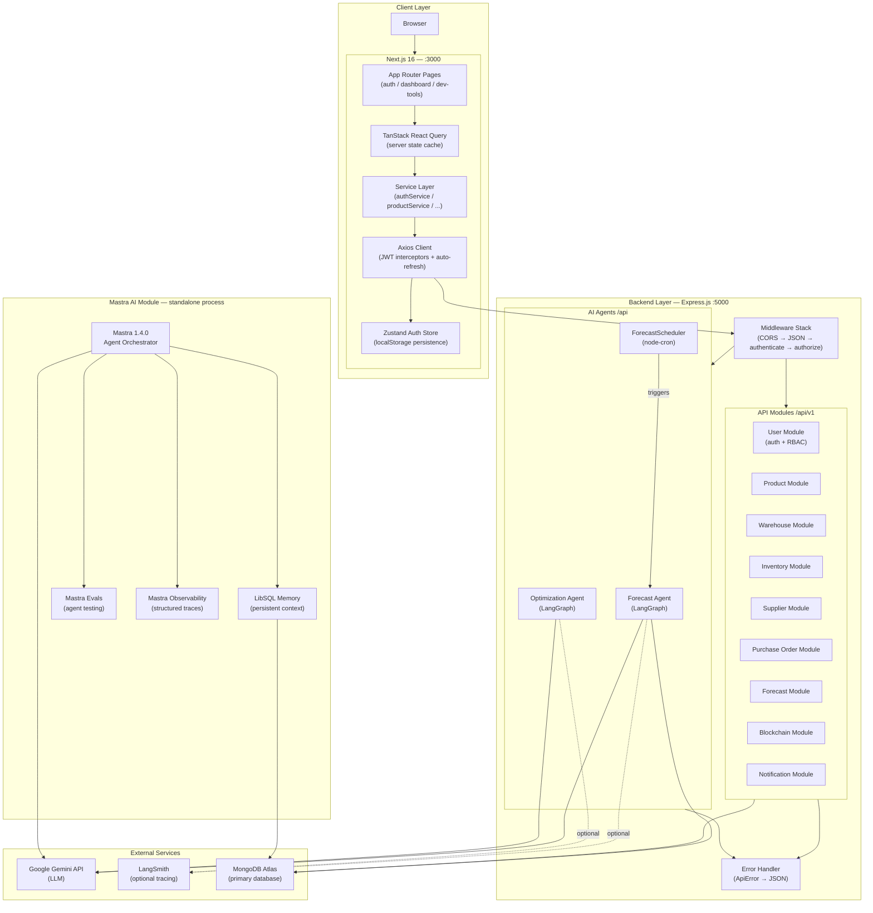

---

## 2. Backend Module Dependency Map

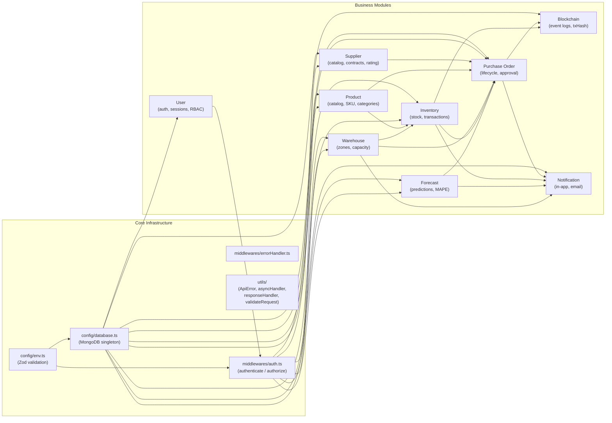

---

## 3. Request Lifecycle

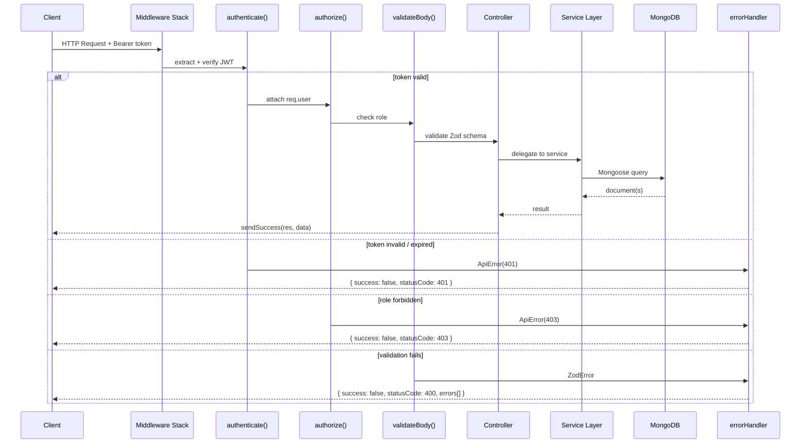

---

## 4. Authentication & Token Flow

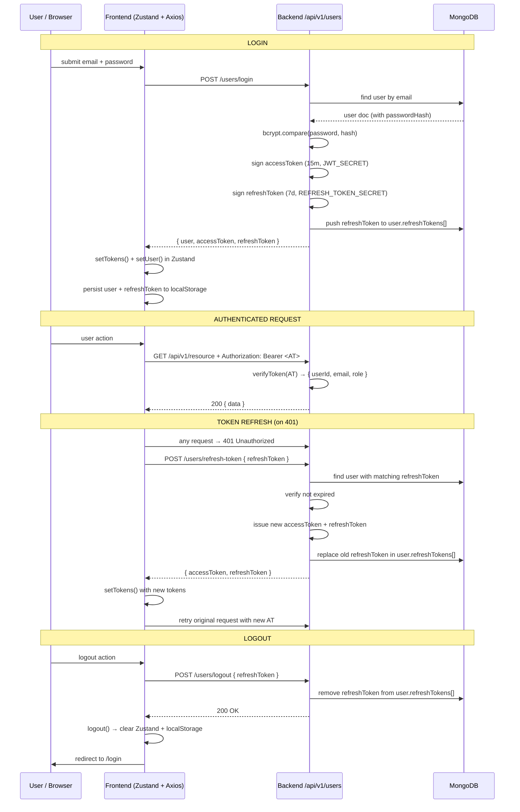

---

## 5. Frontend Data Architecture

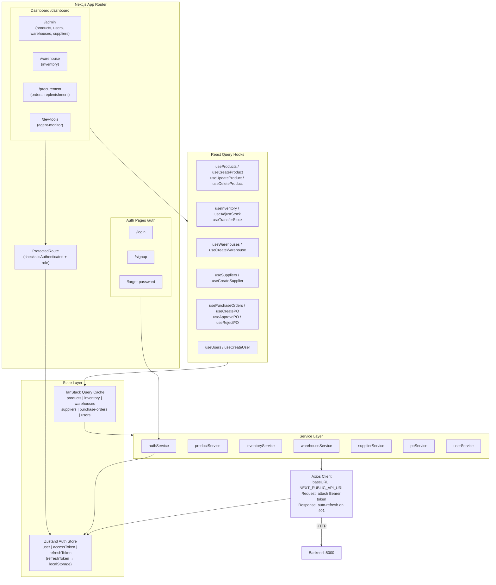

---

## 6. AI Agent Architecture

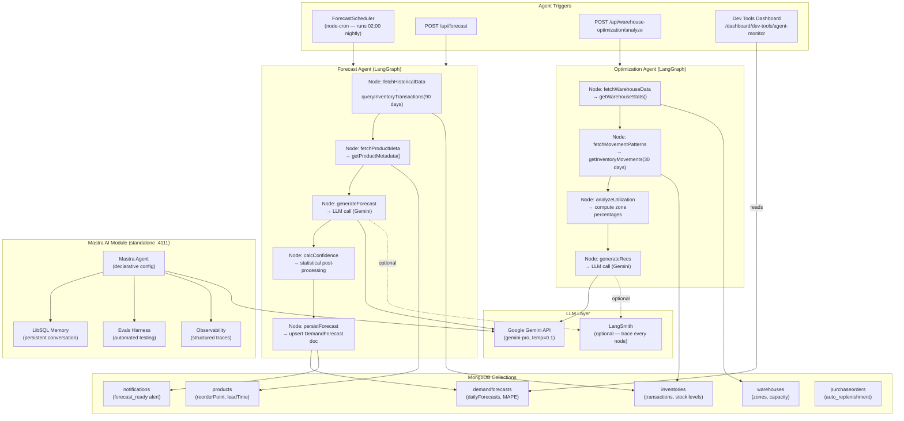

---

## 7. Forecast Agent — Detailed LangGraph State Flow

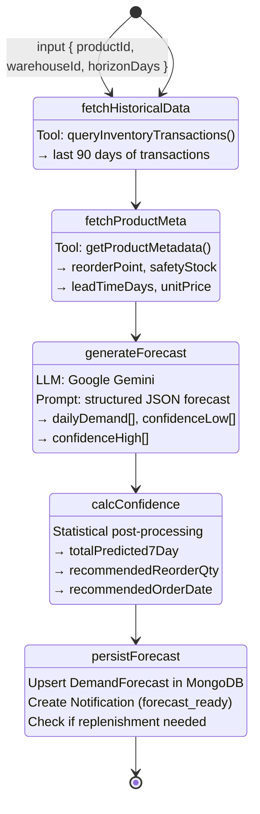

---

## 8. Auto-Replenishment Flow (Forecast → Purchase Order)

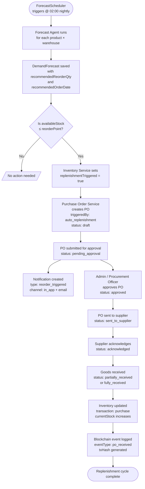

---

## 9. Purchase Order State Machine

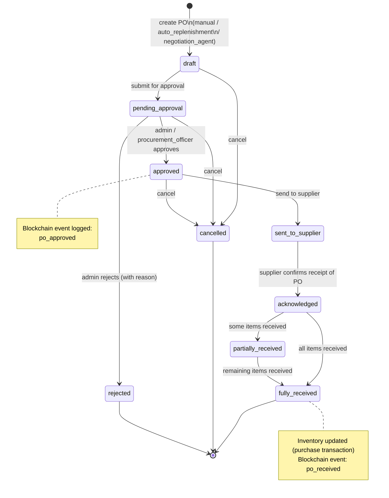

---

## 10. Inventory Transaction Flow

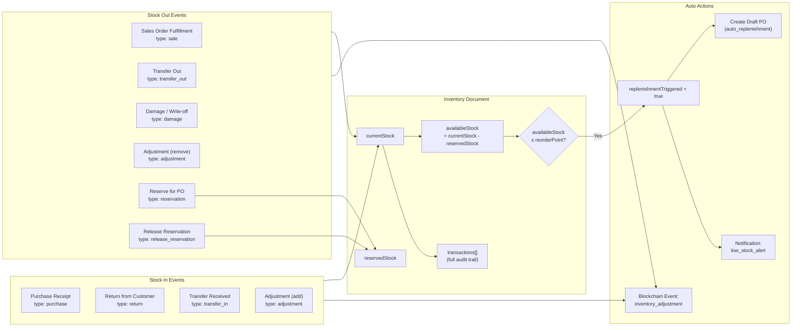

---

## 11. Role-Based Access Control (RBAC)

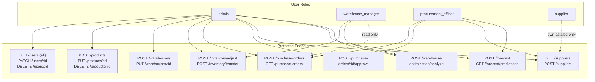

---

## 12. Full Data Model Relationships

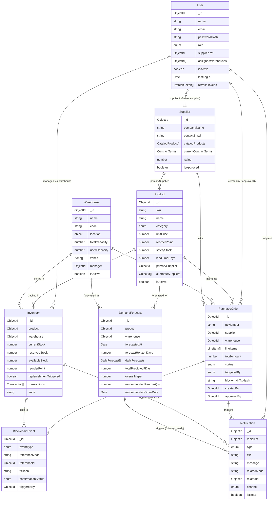

---

## 13. Deployment Architecture

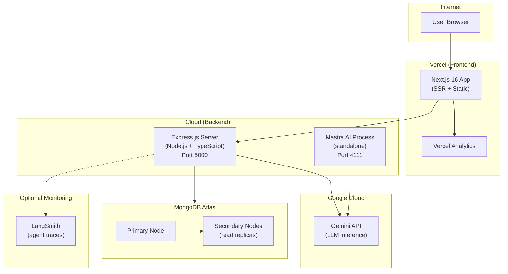
