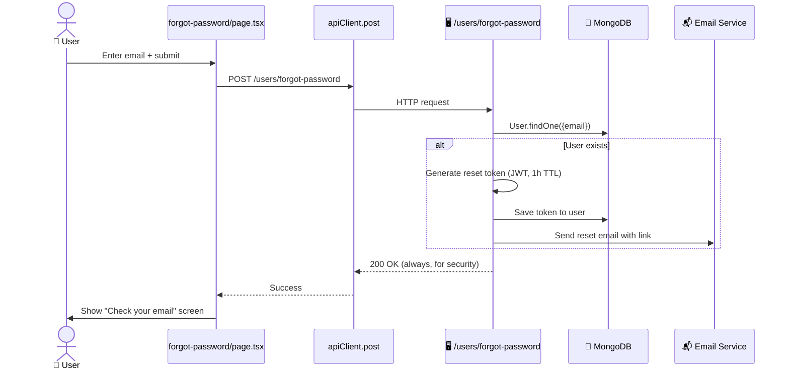

# Forgot Password

> [!info] At a glance
> User enters their email → backend issues a reset link → they click the link → enter new password.

> [!warning] Implementation status
> The frontend form is fully wired. The backend endpoint `POST /users/forgot-password` is a **stub** — returns a friendly message "Password reset is not yet configured. Please contact your administrator." The email-sending infrastructure is future work.

---

## 👤 User Level

1. User on `/login` clicks **"Forgot password?"**
2. Navigates to `/forgot-password`
3. Enters their email address
4. Clicks **Send Reset Link**
5. Spinner shows briefly
6. 📧 Success screen: *"Check your email — if an account exists with `<email>`, we've sent a password reset link."*
7. Button: **Back to Sign In**

(In the current stub, if the backend endpoint is missing, user sees: *"Password reset is not yet configured. Please contact your administrator."*)

---

## 💻 Code / Service Level

### Sequence (when email infra is live)



### Files

| File | Role |
|------|------|
| `frontend/src/app/(auth)/forgot-password/page.tsx` | Client component with form + API call |
| `frontend/src/lib/api/client.ts` | Axios instance |

### Frontend code

```typescript
// frontend/src/app/(auth)/forgot-password/page.tsx
const handleSubmit = async (e: React.FormEvent) => {
  e.preventDefault();
  setIsLoading(true);
  try {
    await apiClient.post('/users/forgot-password', { email });
    setIsSent(true);
    toast.success('Password reset link sent to your email');
  } catch (err: any) {
    if (err.response?.status === 404) {
      toast.info('Password reset is not yet configured. Please contact your administrator.');
    } else {
      toast.error(err.response?.data?.message || 'Failed to send reset link');
    }
  } finally {
    setIsLoading(false);
  }
};
```

### Security notes

- Response is always 200 regardless of whether the email exists (prevents account enumeration attacks)
- Reset tokens should be single-use and expire within 1 hour
- The reset link must be over HTTPS in production
- Rate-limit this endpoint to prevent email spam

---

## 🔗 Linked Flows

- [[Login]] — Return to login
- After reset → [[Login]]

← back to [[README|Flow Index]]
