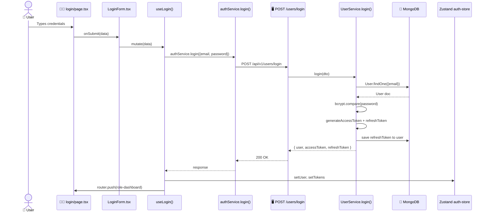

# Login

> [!info] At a glance
> Email + password → JWT access token + refresh token → role-based redirect to the right dashboard.

---

## 👤 User Level — what the human does

1. User navigates to `http://localhost:3000/login`
2. Sees a card with **Email** and **Password** fields
3. Types `admin@autostock.ai` and `Admin@123`
4. Clicks **Sign In**
5. Spinner appears briefly (~400 ms)
6. 📧 Toast: *"Welcome back to AutoStock AI"*
7. Page auto-redirects based on role:
   - Admin → `/dashboard/admin`
   - Warehouse Manager → `/dashboard/warehouse`
   - Procurement Officer → `/dashboard/procurement`
   - Supplier → `/dashboard/supplier`
8. Dashboard loads with their name in the top-right corner

---

## 💻 Code / Service Level

### Sequence



### Files involved

| File | Role |
|------|------|
| `frontend/src/app/(auth)/login/page.tsx` | Server component wrapper, metadata |
| `frontend/src/components/features/auth/login-form.tsx` | The form with react-hook-form + Zod |
| `frontend/src/hooks/use-auth.ts` | `useLogin()` mutation hook |
| `frontend/src/lib/api/services/auth.service.ts` | Axios POST to backend |
| `frontend/src/stores/auth-store.ts` | Zustand store (persisted to localStorage) |
| `backend/src/modules/user/controller.ts` | `login` controller handler |
| `backend/src/modules/user/service.ts` | `UserService.login()` — bcrypt, JWT generation |
| `backend/src/modules/user/model.ts` | Mongoose `User` schema |

### Key code snippets

**Frontend — `useLogin()`:**
```typescript
export const useLogin = () => {
  const { setUser, setTokens } = useAuthStore();
  const router = useRouter();

  return useMutation({
    mutationFn: authService.login,
    onSuccess: (data) => {
      setUser(data.user);
      setTokens(data.accessToken, data.refreshToken);
      toast({ title: 'Welcome back', description: '...' });
      // Role-based redirect
      const role = data.user.role;
      if (role === 'admin') router.push('/dashboard/admin');
      else if (role === 'warehouse_manager') router.push('/dashboard/warehouse');
      // ...
    },
  });
};
```

**Backend — `UserService.login()`:**
```typescript
async login(dto: LoginDto) {
  const user = await User.findOne({ email: dto.email });
  if (!user || !user.isActive) {
    throw new ApiError(401, 'Invalid email or password');
  }

  const valid = await bcrypt.compare(dto.password, user.password);
  if (!valid) throw new ApiError(401, 'Invalid email or password');

  const accessToken = jwt.sign(
    { userId: user._id, email: user.email, role: user.role, type: 'access' },
    JWT_SECRET,
    { expiresIn: '15m' }
  );
  const refreshToken = jwt.sign(
    { userId: user._id, type: 'refresh', tokenId: crypto.randomBytes(32).toString('hex') },
    JWT_REFRESH_SECRET,
    { expiresIn: '7d' }
  );

  user.refreshTokens.push({ token: refreshToken, expiresAt: ... });
  user.lastLogin = new Date();
  await user.save();

  return { user, accessToken, refreshToken };
}
```

### API trace (from real test run)

```
[08:54:12.001] POST /api/v1/users/login                       371 ms
[08:54:12.005]   → UserController.login
[08:54:12.006]   → LoginSchema.parse({email, password})       1 ms
[08:54:12.007]   → UserService.login(dto)
[08:54:12.030]   → User.findOne({email})                      23 ms
[08:54:12.060]   → bcrypt.compare(password, hashedPassword)   30 ms
[08:54:12.061]   → jwt.sign × 2                               <1 ms
[08:54:12.090]   → user.save() to store refreshToken          29 ms
[08:54:12.370]   → response 200 OK with { user, tokens }
[08:54:12.400] Frontend: authStore.setTokens()
[08:54:12.410] Frontend: router.push('/dashboard/admin')
[08:54:12.500] Frontend: Admin dashboard renders
```

Total perceived latency: **~500 ms** from click to dashboard render.

---

## 🔗 Linked Flows

- Next: [[Signup]] — Create a new account
- Forgot password? → [[Forgot Password]]
- After login → [[Create Supplier]] or any dashboard flow

← back to [[README|Flow Index]]
