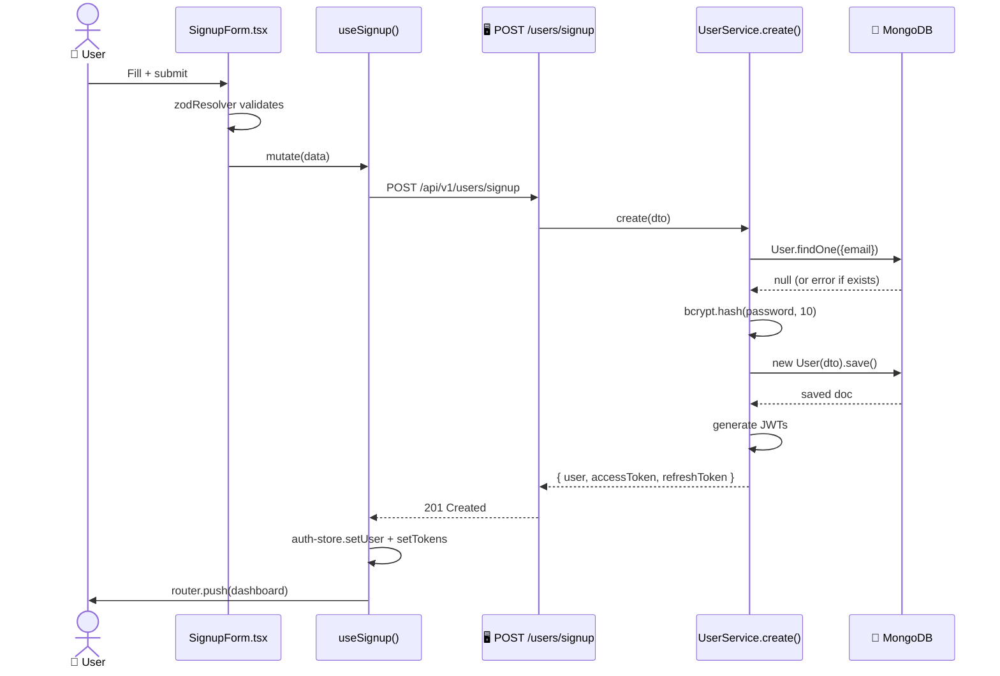

# Signup

> [!info] At a glance
> New user registration with role selection. Password is hashed with bcrypt before storage. Returns JWT tokens immediately so the user is logged in.

---

## 👤 User Level

1. User clicks **"Don't have an account? Sign up"** on the login page
2. Navigates to `/signup`
3. Fills in: Name, Email, Password, Confirm Password, Role (dropdown)
4. Selects a role: Admin / Warehouse Manager / Procurement Officer / Supplier
5. Clicks **Sign Up**
6. 📧 Toast: *"Account created, welcome to AutoStock AI"*
7. Auto-redirect to the role's dashboard (same logic as login)

---

## 💻 Code / Service Level

### Sequence



### Files

| File | Role |
|------|------|
| `frontend/src/app/(auth)/signup/page.tsx` | Page wrapper |
| `frontend/src/components/features/auth/signup-form.tsx` | Form with Zod validation |
| `frontend/src/hooks/use-auth.ts` → `useSignup` | Mutation hook |
| `frontend/src/lib/api/services/auth.service.ts` → `signup()` | Axios POST |
| `backend/src/modules/user/controller.ts` → `signup` | Controller |
| `backend/src/modules/user/service.ts` → `create()` | Bcrypt + JWT + save |

### Key code

```typescript
// backend/src/modules/user/service.ts
async create(dto: CreateUserDto) {
  const exists = await User.findOne({ email: dto.email });
  if (exists) throw new ApiError(409, 'Email already registered');

  const hashed = await bcrypt.hash(dto.password, 10);
  const user = await User.create({ ...dto, password: hashed });

  const accessToken = jwt.sign({...}, JWT_SECRET, { expiresIn: '15m' });
  const refreshToken = jwt.sign({...}, JWT_REFRESH_SECRET, { expiresIn: '7d' });

  user.refreshTokens.push({ token: refreshToken, expiresAt: ... });
  await user.save();

  return { user: user.toObject(), accessToken, refreshToken };
}
```

### Validation rules (from Zod schema)

| Field | Constraint |
|-------|-----------|
| `name` | min 2 chars, max 100 |
| `email` | valid email format, unique |
| `password` | min 8 chars, at least 1 number |
| `role` | enum: admin / warehouse_manager / procurement_officer / supplier |

---

## 🔗 Linked Flows

- After signup → [[Login]] (next time)
- Or jump into [[Create Supplier]] if admin

← back to [[README|Flow Index]]
