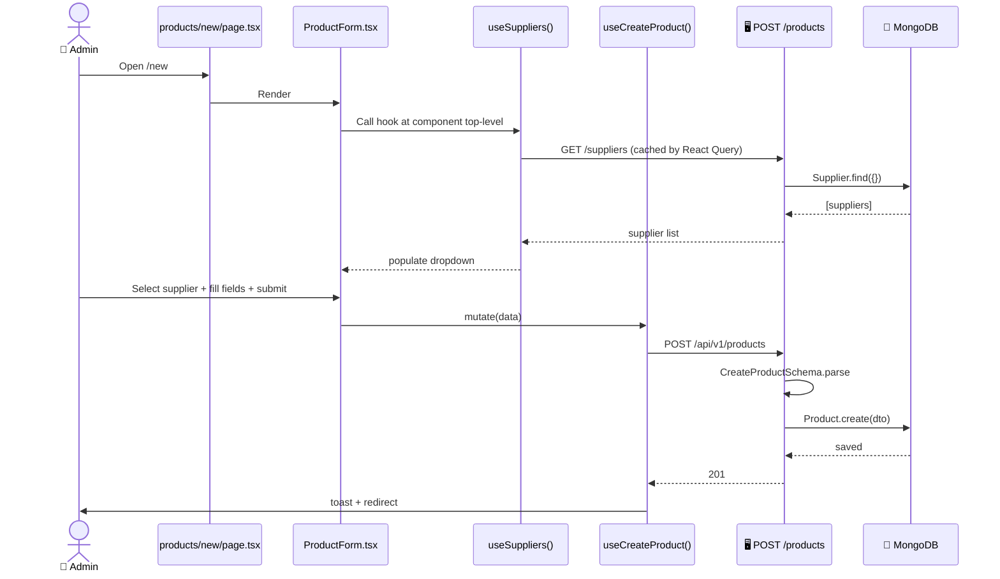

# Create Product

> [!info] At a glance
> Admin creates a new SKU. The form dynamically loads existing suppliers into a dropdown so the primary supplier can be selected. Product becomes available for inventory tracking and forecasting.

---

## 👤 User Level

1. Admin visits `/dashboard/admin/products`
2. Clicks **Add Product**
3. Navigates to `/dashboard/admin/products/new`
4. Form shows:
   - SKU (e.g. `PEN-001`, required, alphanumeric)
   - Name (required)
   - Description (optional)
   - Category (dropdown: writing_instruments, paper_products, office_supplies, ...)
   - Unit (dropdown: piece, box, pack, kg, ...)
   - Unit Price (₹)
   - Reorder Point, Reorder Qty, Safety Stock
   - Lead Time (days)
   - **Primary Supplier (dropdown)** — 👈 populated from `useSuppliers()`
5. Picks a supplier from the dropdown (names come from real DB data)
6. Clicks **Create Product**
7. 📧 Toast: *"Product created"*
8. Redirect to `/dashboard/admin/products`, new row appears

---

## 💻 Code / Service Level

### Sequence



### Files

| File | Role |
|------|------|
| `frontend/src/components/features/products/product-form.tsx` | Form with dynamic supplier dropdown |
| `frontend/src/hooks/queries/use-products.ts` → `useCreateProduct` | Mutation |
| `frontend/src/hooks/queries/use-suppliers.ts` → `useSuppliers` | Loads supplier list |
| `frontend/src/lib/validators/product.validator.ts` | Zod schema (frontend) |
| `backend/src/modules/product/controller.ts` | CRUD handlers |
| `backend/src/modules/product/service.ts` | DB operations |
| `backend/src/modules/product/dto.ts` | Backend Zod DTO |
| `backend/src/modules/product/model.ts` | Mongoose schema |

### Critical fix we made

> [!warning] Earlier bug
> Originally the `primarySupplier` field was a raw text input with the placeholder text "Supplier ID (will be dropdown)". Users had to copy-paste MongoDB ObjectIds manually. We fixed it to be a real `<Select>` component that fetches from `useSuppliers()`.

> [!warning] React Hooks rule violation we also fixed
> Initially `useSuppliers()` was called **inside** the `render` function of `FormField`, which violates React Hook rules (hooks must be called at component top-level). This caused a render loop. We moved it to the top of `ProductForm`.

```tsx
// ✅ Correct (current)
export function ProductForm({ initialData }: ProductFormProps) {
  const { data: suppliersData } = useSuppliers();
  const suppliersList = suppliersData?.data || [];

  return (
    <Form {...form}>
      <FormField
        name="primarySupplier"
        render={({ field }) => (
          <Select onValueChange={field.onChange}>
            <SelectTrigger><SelectValue placeholder="Select a supplier" /></SelectTrigger>
            <SelectContent>
              {suppliersList.map((s: any) => (
                <SelectItem key={s._id} value={s._id}>{s.companyName}</SelectItem>
              ))}
            </SelectContent>
          </Select>
        )}
      />
    </Form>
  );
}
```

### Product schema categories

```typescript
category: z.enum([
  'writing_instruments',
  'paper_products',
  'office_supplies',
  'art_supplies',
  'filing_storage',
  'desk_accessories',
  'other',
]);
```

---

## 🔗 Linked Flows

- Before: [[Create Supplier]] (suppliers must exist first)
- Next: The new product appears in [[Demand Forecast]] runs
- The inventory for this product will be tracked for [[Anomaly Detection]] and [[Smart Reorder]]

← back to [[README|Flow Index]]
