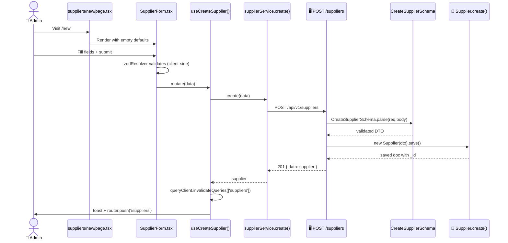

# Create Supplier

> [!info] At a glance
> Admin fills a form → backend validates via Zod DTO → supplier saved to MongoDB → supplier becomes eligible for negotiations.

> [!tip] Why this flow matters
> Without approved suppliers in the database, the [[Negotiation Two-Agent]] workflow cannot run. This is the entry point for the entire agentic procurement chain.

---

## 👤 User Level

1. Admin clicks **Suppliers** in the sidebar → lands on `/dashboard/admin/suppliers`
2. Sees a table of existing suppliers (companyName, email, phone, rating, approval status)
3. Clicks the **Add Supplier** button (top-right)
4. Navigates to `/dashboard/admin/suppliers/new`
5. Form shows:
   - Company Name (required, min 2 chars)
   - Contact Email (required, email format)
   - Contact Phone (required, +91 format)
   - Address (required, min 10 chars)
   - Rating slider (0-5)
   - **Approved** toggle (when ON, supplier can participate in negotiations)
6. Clicks **Create Supplier**
7. Button shows spinner
8. 📧 Toast: *"Supplier created successfully"*
9. Auto-redirect to `/dashboard/admin/suppliers`
10. New row appears at the top of the table

---

## 💻 Code / Service Level

### Sequence



### Files

| File | Role |
|------|------|
| `frontend/src/app/dashboard/admin/suppliers/page.tsx` | List + "Add Supplier" button |
| `frontend/src/app/dashboard/admin/suppliers/new/page.tsx` | New supplier page wrapper |
| `frontend/src/components/features/suppliers/supplier-form.tsx` | React Hook Form + Zod |
| `frontend/src/hooks/queries/use-suppliers.ts` → `useCreateSupplier` | React Query mutation |
| `frontend/src/lib/api/services/supplier.service.ts` → `create` | Axios POST |
| `frontend/src/types/supplier.types.ts` | TypeScript types matching backend |
| `backend/src/modules/supplier/routes.ts` | POST `/suppliers` route |
| `backend/src/modules/supplier/controller.ts` → `create` | Controller |
| `backend/src/modules/supplier/service.ts` → `create` | Mongoose save |
| `backend/src/modules/supplier/dto.ts` → `CreateSupplierSchema` | Zod validation |
| `backend/src/modules/supplier/model.ts` | Mongoose schema |

### Frontend form field mapping

| Frontend field | Backend field | Why |
|----------------|---------------|-----|
| `companyName` | `companyName` | Match |
| `contactEmail` | `contactEmail` | Match (was `email` but we fixed it) |
| `contactPhone` | `contactPhone` | Match |
| `address` | `address` | Match |
| `rating` | `rating` | 0-5 |
| `isApproved` | `isApproved` | Boolean |

> [!warning] Common bug we fixed
> Earlier the frontend sent `{name, email, phone}` but the backend schema expected `{companyName, contactEmail, contactPhone}`. This caused every create to fail with validation errors. Both are now aligned.

### Backend validation (Zod)

```typescript
// backend/src/modules/supplier/dto.ts
export const CreateSupplierSchema = z.object({
  companyName: z.string().min(2).max(200).trim(),
  contactEmail: z.string().email().toLowerCase().trim(),
  contactPhone: z.string().regex(/^[+]?[(]?[0-9]{1,4}[)]?[-\s.]?[(]?[0-9]{1,4}[)]?[-\s.]?[0-9]{1,9}$/),
  address: z.string().min(10).trim(),
  catalogProducts: z.array(CatalogProductSchema).default([]),
  rating: z.number().min(0).max(5).default(0),
  isApproved: z.boolean().default(false),
});
```

### API trace

```
[12:30:45.123] POST /api/v1/suppliers                        204 ms
[12:30:45.130]   → SupplierController.create
[12:30:45.131]   → CreateSupplierSchema.parse(body)           1 ms
[12:30:45.132]   → SupplierService.create(dto)
[12:30:45.180]   → new Supplier(dto).save()                  48 ms
[12:30:45.300]   → 201 Created
[12:30:45.310] Frontend: queryClient.invalidateQueries(['suppliers'])
[12:30:45.400] Frontend: useSuppliers refetch
[12:30:45.470] Frontend: table re-renders with new row
```

---

## 🔗 Linked Flows

- Before: [[Login]] (must be admin)
- Related: [[Create Product]] — the new supplier shows up in the product form's dropdown
- Next: [[Negotiation Two-Agent]] — now this supplier can be negotiated with

← back to [[README|Flow Index]]
