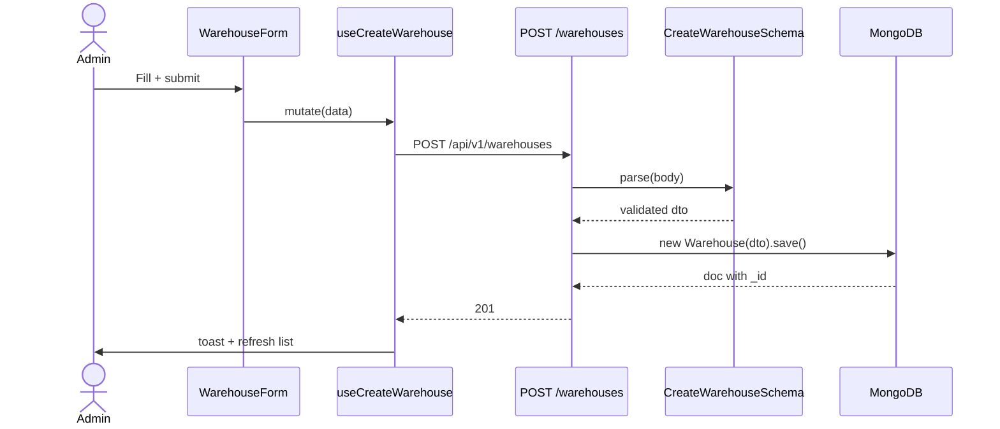

# Create Warehouse

> [!info] At a glance
> Register a physical warehouse location with capacity tracking. Required before any inventory or optimization flows can run.

---

## 👤 User Level

1. Admin visits `/dashboard/admin/warehouses`
2. Sees table of existing warehouses (name, code, location, utilization)
3. Clicks **Add Warehouse**
4. Form:
   - Name (e.g. "East Hub Kolkata")
   - Code (unique, max 10 uppercase chars, e.g. `WHEASKLK`)
   - Location → Address, City, State, Country, Pincode
   - Total Capacity (units)
   - Used Capacity (starts at 0)
   - Active toggle
5. Clicks **Create**
6. 📧 Toast + redirect to list

---

## 💻 Code / Service Level

### Flow



### Files

| File | Role |
|------|------|
| `frontend/src/components/features/warehouses/warehouse-form.tsx` | Form |
| `frontend/src/hooks/queries/use-warehouses.ts` | Mutations |
| `backend/src/modules/warehouse/routes.ts` | Routes |
| `backend/src/modules/warehouse/controller.ts` | Handlers |
| `backend/src/modules/warehouse/dto.ts` | Zod schemas |
| `backend/src/modules/warehouse/model.ts` | Mongoose schema |

### Schema highlights

```typescript
export const CreateWarehouseSchema = z.object({
  name: z.string().min(2).max(100),
  code: z.string().max(10).regex(/^[A-Z0-9]+$/, "Must be uppercase alphanumeric"),
  location: z.object({
    address: z.string().min(5),
    city: z.string(),
    state: z.string(),
    country: z.string().default('India'),
    pincode: z.string(),
  }),
  totalCapacity: z.number().positive(),
  usedCapacity: z.number().nonnegative().default(0),
  isActive: z.boolean().default(true),
});
```

> [!warning] Common validation errors
> - `code` with lowercase → rejected by regex
> - `code` longer than 10 chars → rejected
> - Missing `location.address` → rejected (we fixed this in the test suite)

---

## 🔗 Linked Flows

- Before: [[Login]] as admin
- Related: [[Create Supplier]], [[Create Product]]
- Next: [[Warehouse Optimization]] — optimization agent analyzes all active warehouses

← back to [[README|Flow Index]]
