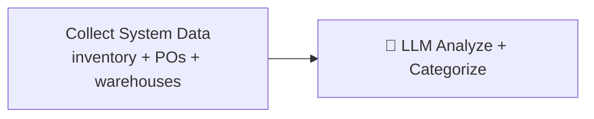

# Anomaly Detection (AI Agent)

> [!info] At a glance
> `anomalyDetectionAgent` scans system-wide data (inventory, POs, warehouse capacity) for unusual patterns: stockouts, fraud indicators, capacity issues, demand spikes. Returns categorized alerts with severity.

---

## 👤 User Level

1. Admin clicks **Run Anomaly Scan** on the Agent Hub
2. Spinner ~20 seconds
3. Results panel:
   - Summary: "5 anomalies found — 1 critical, 3 warning, 1 info"
   - Health score: 76/100
   - Alert cards grouped by category and severity
4. Click an alert → see details and recommended action

---

## 💻 Code / Service Level

### Detection categories

| Category | What it looks for |
|----------|-------------------|
| **Inventory** | Stock below safety, stock-to-ROP ratio < 0.5 (severe understocking), > 3.0 (overstocked) |
| **Procurement** | PO amounts > 2× average (fraud indicator), high manual PO frequency, supplier concentration > 60% |
| **Warehouse** | Capacity > 95% (overflow) or < 20% (underused) |
| **Demand** | Actual vs forecast deviation > 50% |

### Severity & health score

```
criticalCount × 20 + warningCount × 5 + infoCount × 1
healthScore = 100 - (above)  (min 0)
```

### Workflow (2 steps)



### Files

| File | Role |
|------|------|
| `ai/src/mastra/workflows/anomaly-detection-workflow.ts` | 2-step workflow |
| `ai/src/mastra/agents/anomaly-detection-agent.ts` | LLM agent |
| `ai/src/mastra/tools/anomaly-detection-tools.ts` | fetchInventorySnapshot, fetchRecentPOActivity, fetchWarehouseCapacity |

### Output

```json
{
  "scanTimestamp": "2026-04-11T10:30:00Z",
  "anomalies": [
    {
      "id": "ANM-001",
      "category": "inventory",
      "severity": "critical",
      "title": "Stock below safety level",
      "description": "Ring Binder A4 at WHEASKLK has 3 units, safety stock is 5. Will stockout in <1 day.",
      "affectedEntity": {
        "type": "product",
        "id": "69d88...",
        "name": "Ring Binder A4 2-inch"
      },
      "metrics": {
        "actual": 3,
        "expected": 5,
        "deviation": -40
      },
      "recommendedAction": "Trigger emergency procurement immediately via Procurement Orchestrator"
    },
    {
      "id": "ANM-002",
      "category": "procurement",
      "severity": "warning",
      "title": "Supplier concentration risk",
      "description": "Acme Supplies accounts for 72% of last 30 days spend. Diversification recommended.",
      "affectedEntity": { "type": "supplier", "id": "...", "name": "Acme Supplies" },
      "metrics": { "actual": 72, "expected": 50, "deviation": 44 },
      "recommendedAction": "Run supplier evaluation and activate secondary suppliers"
    }
  ],
  "summary": {
    "totalAnomalies": 5,
    "criticalCount": 1,
    "warningCount": 3,
    "infoCount": 1,
    "overallHealthScore": 76
  }
}
```

### Performance

From test: **~20 seconds** per scan (single LLM call on aggregated snapshot).

### When to run

- **On-demand** from Agent Hub (user trigger)
- **Scheduled** — could be added to ForecastScheduler as nightly job
- **Triggered** — after any large data change (not currently implemented)

---

## 🔗 Linked Flows

- Related: [[Supplier Evaluation]] (also produces supplier alerts)
- Related: [[Procurement Orchestrator]] (handles the "stock too low" critical anomalies)
- Related: [[Warehouse Optimization]] (handles "capacity imbalance" anomalies)

← back to [[README|Flow Index]]
