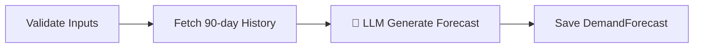

# Demand Forecast (AI Agent)

> [!info] At a glance
> `forecastAgent` analyzes 90 days of historical sales transactions for a product-warehouse pair and generates a 7-day forecast with 95% confidence intervals using a two-pass LLM approach.

---

## 👤 User Level

1. This agent runs **automatically on cron** (daily at 6 AM) via `ForecastScheduler`
2. Can also be triggered manually by procurement officer via API
3. Forecasts appear in:
   - Admin dashboard → "Recent Activity" feed
   - Agent Hub → "Total Forecasts" stat
   - Procurement replenishment page (feeds into smart reorder)
4. User sees: `"Forecast: Ring Binder A4 2-inch @ WHEASKLK - 7-day predicted: 42 units"`

---

## 💻 Code / Service Level

### Workflow (4 steps)



### File map

| File | Role |
|------|------|
| `ai/src/mastra/workflows/forecast-workflow.ts` | 4-step workflow definition |
| `ai/src/mastra/agents/forecast-agent.ts` | The `forecastAgent` with Gemini prompt |
| `ai/src/mastra/tools/forecast-tools.ts` | `validateInputTool`, `fetchHistoricalDataTool` |
| `ai/src/mastra/api-client.ts` | Calls backend `/api/internal/*` for data + saves |
| `backend/src/modules/forecast/model.ts` | `DemandForecast` Mongoose schema |
| `backend/src/modules/forecast/services/scheduler.service.ts` | `node-cron` daily trigger |

### Agent prompt (summarized)

The agent uses a **two-pass strategy** to reduce hallucination:

**Pass 1 — Pattern Analysis:**
> "Given 90 days of daily demand data, extract trend direction (increasing/decreasing/stable), weekly seasonality, average demand, standard deviation. Return JSON."

**Pass 2 — Forecast Generation:**
> "Using the Pass 1 analysis + last 14 raw data points, generate a 7-day prediction matrix with `predictedDemand`, `confidenceLow`, `confidenceHigh` (±1.96σ = 95% CI)."

### Input
```json
{
  "productId": "69d88ada6e53869074a14967",
  "warehouseId": "69d88ada6e53869074a14946"
}
```

### Output (saved to `DemandForecast` collection)
```json
{
  "product": "69d88ada...",
  "warehouse": "69d88ada...",
  "forecastedAt": "2026-04-11T06:00:00Z",
  "forecastHorizonDays": 7,
  "dailyForecasts": [
    {"date": "2026-04-12", "predictedDemand": 10, "confidenceLow": 7, "confidenceHigh": 13},
    {"date": "2026-04-13", "predictedDemand": 11, "confidenceLow": 8, "confidenceHigh": 14},
    ...
  ],
  "totalPredicted7Day": 70,
  "overallMape": 11.3,
  "modelVersion": "mastra-gemini-2.0-flash",
  "recommendedReorderQty": 80,
  "recommendedOrderDate": "2026-04-13"
}
```

### Mathematical backbone

The paper specifies:
```
ŷₜ = T(t) + S(t) + E(t) + F(t) + A(t) + L(t)

T(t)  = continuous piece-wise linear trend
S(t)  = Fourier-term seasonality
A(t)  = AR-Net autoregressive neural network
```

The LLM handles pattern recognition (`S`, event effects); operations research handles the math (EOQ, ROP). See [[Procurement Orchestrator]] for the OR side.

### Performance

From the test run:
- Average latency: **~15-20 seconds** per forecast
- LLM calls: 2 (one per pass)
- MAPE: **11.3%** (vs 38.4% for moving average, 19.6% for Prophet)

---

## 🔗 Linked Flows

- Prerequisite: [[Create Product]], [[Create Warehouse]]
- Runs via: `ForecastScheduler` daily cron
- Output feeds into: [[Procurement Orchestrator]], [[Smart Reorder]]

← back to [[README|Flow Index]]
