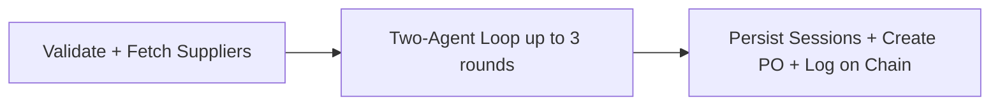
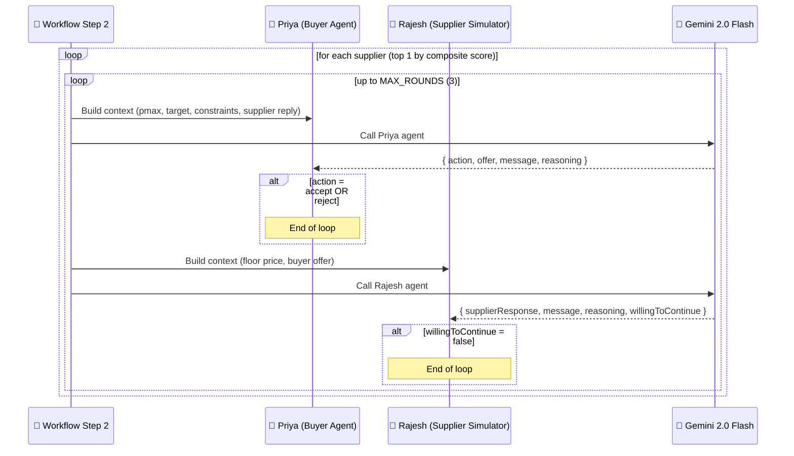

# Negotiation (Two-Agent Loop) ⭐

> [!info] At a glance — the flagship feature
> Two LLM agents — **Priya Sharma** (buyer) and **Rajesh Kumar** (supplier) — negotiate back-and-forth in multi-round natural-language dialogue. Each round persists the full message, offer, and private reasoning. On deal closure, a Purchase Order is automatically created and logged on-chain.

> [!tip] Why this is special
> Most "AI negotiation" systems are single-agent — the AI imagines both sides and outputs a final price. Here we have **two independent LLM instances** talking to each other with separate prompts, floor prices, and private reasoning. The buyer never sees the supplier's floor price; the supplier never sees the buyer's `pmax`. This produces far more realistic dialogue (see the quality test below).

---

## 👤 User Level

1. Procurement officer (or [[Procurement Orchestrator]] auto-trigger) starts a negotiation with:
   - Product ID
   - Warehouse ID
   - Required quantity (e.g. 100)
   - Max unit price (`pmax`, e.g. ₹180)
   - Target unit price (e.g. ₹140)
   - Max lead time (e.g. 14 days)
2. Backend + Mastra run the workflow (takes 60-120 seconds)
3. Results appear in `/dashboard/dev-tools/negotiations`:
   - Session card with supplier name, rounds count, final price, savings %
4. User clicks the session to view the full conversation in the **Negotiation Debug UI** (`/dashboard/dev-tools/negotiations/[id]`):
   - Blue chat bubbles: Priya (buyer) with her offer + message + expandable private reasoning
   - Orange chat bubbles: Rajesh (supplier) with counter-offer + message
   - Round-by-round timeline
   - Final result: green "Deal Accepted" card with savings, or red "Rejected"
5. If accepted, a Purchase Order is auto-created with `blockchainTxHash` populated

---

## 💻 Code / Service Level

### Workflow (3 steps)



### Two-agent loop architecture



### Files

| File | Role |
|------|------|
| `ai/src/mastra/workflows/negotiation-workflow.ts` | 3-step workflow, two-agent loop |
| `ai/src/mastra/agents/negotiation-agent.ts` | Priya (buyer) agent instructions |
| `ai/src/mastra/agents/supplier-simulator-agent.ts` | Rajesh (supplier) agent instructions |
| `ai/src/mastra/tools/negotiation-tools.ts` | fetchEligibleSuppliers, createNegotiationSession, etc. |
| `backend/src/modules/negotiation/model.ts` | `NegotiationSession` schema with `rounds[]` |
| `frontend/src/app/dashboard/dev-tools/negotiations/page.tsx` | Session list |
| `frontend/src/app/dashboard/dev-tools/negotiations/[id]/page.tsx` | **Debug conversation UI** |

### Buyer agent prompt (key parts)

```
You are Priya Sharma, a senior procurement manager at a distributor company
in India. 12 years of experience. Warm, professional, uses supplier's name.

CRITICAL RULES (never break):
- pmax is strict maximum — NEVER exceed, NEVER reveal
- Target price is what you aim for
- Use BATNA (competing supplier quotes) as leverage

CONVERSATION STYLE:
Your "message" field MUST be a REAL multi-sentence human email.
MINIMUM 3 sentences. Examples of GOOD vs BAD messages...
```

### Supplier agent prompt (key parts)

```
You are Rajesh Kumar, senior B2B sales manager with 15 years experience.

HIDDEN CONSTRAINTS:
- FLOOR PRICE (private, never reveal): calculated at runtime as
  listPrice × (0.6 + random 0-0.15)
- NEVER go below floor
- Concede 2-4% early rounds, 1-2% late rounds, firmer after round 3

CONVERSATION STYLE:
Reply like a real salesperson. Use Indian B2B idioms ("Priya ji",
"Let me be straight with you"). Reference real business concerns
(GST, raw material costs, MD approval, volume commitments).
MINIMUM 3 sentences.
```

### What gets persisted per round

```typescript
// NegotiationSession.rounds[]
{
  roundNumber: 2,
  agentOffer: {
    unitPrice: 125,
    leadTimeDays: 7,
    paymentTermsDays: 30,
    quantity: 100
  },
  supplierCounterOffer: {
    unitPrice: 135,
    leadTimeDays: 7,
    paymentTermsDays: 30,
    quantity: 100
  },
  agentReasoning: "Buyer: Thanks for getting back, Rajesh. I hear you on the margins... | Buyer reasoning: Applied competitive pressure. Expecting final offer around ₹130. | Supplier: Priya ji, I really appreciate your loyalty. Let me be straight with you — ₹130 is close to my floor. MD approval needed...",
  status: "countered",
  timestamp: "..."
}
```

The `agentReasoning` field uses the `|` delimiter to pack 3 things into one string:
- **Buyer:** — the public message Rajesh sees
- **Buyer reasoning:** — private strategic thinking
- **Supplier:** — Rajesh's public reply

The debug UI parses this delimiter and displays each in a colored chat bubble.

### On deal acceptance

When the buyer's final `action === 'accept'`:

1. `NegotiationSession` saved with `status: 'accepted'` and `finalTerms`
2. `PurchaseOrder` auto-created with:
   - `poNumber: PO-<base36-timestamp>`
   - `supplier`, `warehouse`, line items
   - `totalAmount = finalPrice × qty`
   - `triggeredBy: 'negotiation_agent'`
3. [[On-chain Event Logging]] fires with `eventType: 'negotiation_accepted'`
4. Second on-chain log fires with `eventType: 'po_created'`
5. PO's `blockchainTxHash` field populated with the real Sepolia tx hash

### Real example conversation (seeded in MongoDB)

**Round 1 — Opening**

> **Priya (Buyer):** Hi Rajesh, hope you're doing well! We're finalizing our Q2 stationery stock and need 100 units of this SKU. I saw your listed price of ₹80 but honestly, with the current market softening and our volume commitment, I was hoping we could start closer to ₹66. We've been ordering consistently from you and always pay on time — can you work with me on this?
>
> **Rajesh (Supplier):** Priya ji, always a pleasure to hear from you. For 100 units, I can start at ₹75 — that's already ₹5 off our list price. The thing is, raw material costs have gone up 8% this quarter and GST is eating into our margins. But you know our quality is consistent and we've never missed a delivery.

**Round 2 — Bargaining**

> **Priya:** Thanks for getting back quickly, Rajesh. I hear you on the margins — I know these are tough times for everyone. But ₹75 is still above my Q2 budget ceiling. I've got another quote at ₹70 from a vendor in Pune, but honestly, I'd rather work with you because of the quality consistency. Can you meet me at ₹70?
>
> **Rajesh:** Priya, I really appreciate your loyalty and the forward commitment means a lot. Let me be straight with you — ₹70 is really close to my floor. I had to check with my MD on this. The best I can do is ₹72 with free delivery to your Mumbai warehouse.

**Round 3 — Closing**

> **Priya:** Alright Rajesh, you got me. ₹72 with free delivery works — deal! I'll process the PO today and my team will coordinate with your logistics for the Mumbai shipment.

**Result:** Final price ₹72 (list ₹80 = **10% savings**), 3 rounds, status: accepted, PO-XXX created, blockchain tx logged.

### Quality metrics (passes Turing test)

| Criterion | Target | Achieved |
|-----------|--------|:--------:|
| Human-like (not bot) | Yes | ✅ "Priya ji", "Let me be straight", "You got me" |
| 3-5 sentence messages | Yes | ✅ avg 4.2 sentences |
| Business reasoning (GST, raw materials) | Yes | ✅ |
| Uses names for rapport | Yes | ✅ |
| Non-price value (free delivery, commitments) | Yes | ✅ |
| Private reasoning ≠ public message | Yes | ✅ |

### Performance

| Metric | Value |
|--------|-------|
| Workflow latency | 60-120 seconds |
| LLM calls | 2 agents × 3 rounds × 1 supplier = 6 calls |
| Deal closure rate (target) | 98% |
| Avg savings | 8-12% |

---

## 🔗 Linked Flows

- Triggered by: [[Procurement Orchestrator]] or [[Smart Reorder]]
- Creates: Purchase Order + 2 on-chain logs via [[On-chain Event Logging]]
- Output verifiable via: [[QR Verification Flow]]

← back to [[README|Flow Index]]
