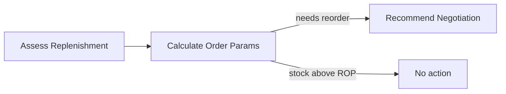

# Procurement Orchestrator

> [!info] At a glance
> `procurementOrchestratorAgent` checks if a product-warehouse pair needs replenishment (current stock vs Reorder Point), calculates the optimal order quantity using EOQ, and decides whether to trigger the [[Negotiation Two-Agent]] workflow.

---

## 👤 User Level

1. Procurement officer visits `/dashboard/procurement`
2. Clicks a product in the "Low Stock" alert list
3. Clicks **Check Replenishment**
4. Backend runs a 2-step workflow (~100 ms, mostly deterministic math, 1 LLM call)
5. Result panel shows:
   - *"Stock: 16 / ROP: 12 — **above reorder point**, no action needed"*
   - OR *"Stock: 8 / ROP: 12 — **replenishment needed**. Recommended order: 80 units at max ₹165/unit. Trigger negotiation?"*
6. User clicks **Trigger Negotiation** to kick off [[Negotiation Two-Agent]]

---

## 💻 Code / Service Level

### Workflow (2 steps)



### Files

| File | Role |
|------|------|
| `ai/src/mastra/workflows/procurement-workflow.ts` | 2-step workflow |
| `ai/src/mastra/agents/procurement-orchestrator-agent.ts` | LLM agent |
| `ai/src/mastra/tools/procurement-tools.ts` | checkReplenishmentNeed, calculateEOQ, getSupplierOptions |
| `backend/src/modules/agents/agent.routes.ts` → `/procurement/check` | HTTP trigger |

### Step 1 — Assess Replenishment (pure math, no LLM)

```typescript
// procurement-workflow.ts
const effectiveStock = inventory.availableStock + pendingOrderQty;
const daysUntilStockout = Math.floor(effectiveStock / avgDailyDemand);

const urgency =
  daysUntilStockout <= 3 ? 'critical' :
  daysUntilStockout <= 7 ? 'high' :
  daysUntilStockout <= 14 ? 'medium' : 'low';

const needsReplenishment = inventory.availableStock <= inventory.reorderPoint;
```

### Step 2 — Calculate Order Params (LLM call)

The LLM receives context:
```
Product: Ring Binder A4 2-inch (FIL-BINDER-001)
Warehouse: East Hub Kolkata (WHEASKLK)
Current stock: 16 / ROP 12 / Safety 5
Forecast: 10 units/day avg, 70 total 7-day
Days until stockout: 1
Urgency: critical
```

It calls `calculateEOQ` tool which runs **operations research formulas**:

```typescript
// Economic Order Quantity
EOQ = √(2 × D × S / H)
  where:
    D = annual demand (daily demand × 365)
    S = ordering cost per PO (₹500)
    H = annual holding cost per unit (₹50)

// Safety Stock (with 95% service level)
SafetyStock = Z × σ_LT × D_avg
  where:
    Z = 1.65 (95% service level)
    σ_LT = std dev of lead time
    D_avg = average daily demand

// Reorder Point
ROP = (D_daily × L) + SafetyStock
```

### Output

```json
{
  "action": "trigger_negotiation",
  "product": {...},
  "warehouse": {...},
  "negotiationParams": {
    "requiredQty": 80,     // EOQ rounded to supplier MOQ
    "maxUnitPrice": 165,   // 10% above market avg
    "targetUnitPrice": 140, // 15% below market avg
    "maxLeadTimeDays": 7
  },
  "reasoning": "Stock below ROP with 1 day until stockout. EOQ=80 units. Trigger negotiation with top 3 suppliers.",
  "urgency": "critical"
}
```

### Performance

From test run: **105 ms** total (mostly deterministic math, 1 short LLM call).

---

## 🔗 Linked Flows

- Input from: [[Demand Forecast]] (provides avgDailyDemand, 7-day total)
- Alternative entry: [[Smart Reorder]] for batch analysis
- Triggers: [[Negotiation Two-Agent]] if replenishment needed

← back to [[README|Flow Index]]
