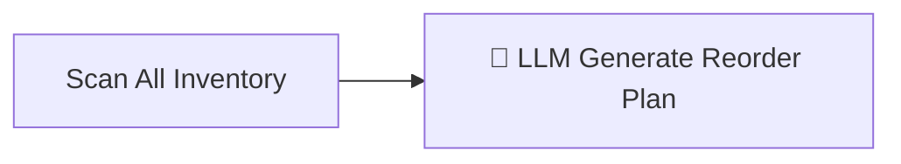

# Smart Reorder (AI Agent)

> [!info] At a glance
> `smartReorderAgent` scans ALL products across ALL warehouses in one pass, identifies items needing reorder, and generates a consolidated reorder plan with EOQ-optimized quantities. This is the "batch" counterpart to [[Procurement Orchestrator]].

---

## 👤 User Level

1. Procurement officer visits `/dashboard/procurement/replenishment`
2. Clicks **Run Analysis** button
3. Spinner: *"Scanning 60 inventory items across 5 warehouses..."* (~2 minutes)
4. Results page shows:
   - Summary: *"8 products need reorder, 3 critical, ₹245,000 estimated spend"*
   - Grouped recommendations per supplier (for consolidation)
   - Each card: Product → From Warehouse → To Warehouse → Qty + AI reasoning
5. Accept/Reject per recommendation

---

## 💻 Code / Service Level

### Workflow (2 steps)



### Files

| File | Role |
|------|------|
| `ai/src/mastra/workflows/smart-reorder-workflow.ts` | 2-step workflow |
| `ai/src/mastra/agents/smart-reorder-agent.ts` | LLM agent with EOQ tool |
| `ai/src/mastra/tools/smart-reorder-tools.ts` | `getReorderAnalysis` |
| `frontend/src/app/dashboard/procurement/replenishment/page.tsx` | UI with "Run Analysis" button |

### Scan logic (Step 1, deterministic)

```typescript
// For every product-warehouse pair
const pendingIncoming = /* sum of all open POs for this product */;
const recentTxns = /* sales in last 30 days */;
const avgDailyDemand = sum(recentTxns) / 30;
const effectiveStock = availableStock + pendingIncoming;
const daysUntilStockout = effectiveStock / avgDailyDemand;
const needsReorder = availableStock <= reorderPoint && pendingIncoming === 0;
```

### LLM Step

Receives the list of items needing reorder and generates a consolidated plan:

**Key capabilities:**
- **Consolidation** — if 3 products come from the same supplier, recommends one PO instead of three (reduces ordering cost)
- **MOQ awareness** — adjusts EOQ up to supplier minimum order quantity
- **Price break optimization** — if ordering 10% more reaches a bulk discount, increases quantity
- **Urgency prioritization** — critical items first

### Output

```json
{
  "analysisDate": "2026-04-11",
  "reorderRecommendations": [
    {
      "productId": "...",
      "productName": "Ring Binder A4",
      "sku": "FIL-BINDER-001",
      "warehouseName": "East Hub Kolkata",
      "urgency": "critical",
      "currentStock": 16,
      "daysUntilStockout": 1,
      "recommendedQty": 80,
      "eoq": 75,
      "estimatedUnitPrice": 155,
      "estimatedTotalCost": 12400,
      "reasoning": "Days until stockout = 1 (critical). EOQ=75 but supplier MOQ=100. Recommending 80."
    }
  ],
  "consolidationOpportunities": [
    {
      "supplierId": "...",
      "products": ["FIL-BINDER-001", "PEN-001", "NOTE-A4"],
      "combinedValue": 45000,
      "savingsEstimate": 2500
    }
  ],
  "summary": {
    "totalProducts": 60,
    "needingReorder": 8,
    "criticalItems": 3,
    "estimatedTotalSpend": 245000
  }
}
```

### Performance

From measured test: **~123 seconds** total (the LLM call is slow because the prompt has ~60 product rows to analyze; needs parallelization in production).

---

## 🔗 Linked Flows

- Batch version of: [[Procurement Orchestrator]] (single product)
- Uses data from: [[Demand Forecast]] (avgDailyDemand)
- Output feeds: [[Negotiation Two-Agent]] (per recommendation)

← back to [[README|Flow Index]]
