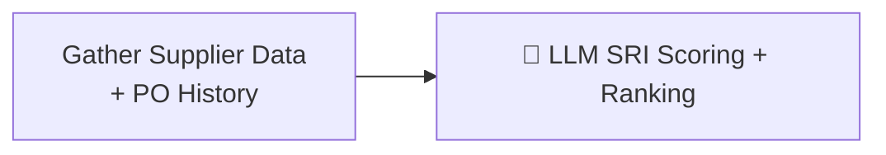

# Supplier Evaluation (AI Agent)

> [!info] At a glance
> `supplierEvaluationAgent` scores all approved suppliers using the **Supplier Reliability Index (SRI)** formula and ranks them. Underperformers get flagged for diversification recommendations.

---

## 👤 User Level

1. Admin or procurement officer clicks **Run Evaluation** on the Agent Hub
2. Spinner for ~30 seconds
3. Results page shows a ranked list of suppliers with:
   - SRI score (0-100)
   - Status badge: excellent / good / average / underperforming / critical
   - Per-metric breakdown (on-time rate, quality, price competitiveness, responsiveness)
   - Recommendations (e.g. "Consider diversifying — 72% spend is with this supplier")
4. Critical alerts flagged in red

---

## 💻 Code / Service Level

### SRI Formula

```
SRI = w1×OnTimeRate + w2×QualityScore + w3×PriceCompetitiveness + w4×Responsiveness

w1 = 0.35  (on-time delivery weight)
w2 = 0.25  (quality/cancellation rate)
w3 = 0.25  (price competitiveness — avg negotiation savings)
w4 = 0.15  (responsiveness — deal closure rate)
```

Each sub-metric is 0-100. Final SRI ranges 0-100.

### Status thresholds

| SRI Range | Status |
|-----------|--------|
| ≥ 85 | excellent |
| ≥ 70 | good |
| ≥ 50 | average |
| ≥ 30 | underperforming |
| < 30 | critical |

### Workflow (2 steps)



### Files

| File | Role |
|------|------|
| `ai/src/mastra/workflows/supplier-evaluation-workflow.ts` | 2-step workflow |
| `ai/src/mastra/agents/supplier-evaluation-agent.ts` | LLM agent |
| `ai/src/mastra/tools/supplier-evaluation-tools.ts` | fetchAllSuppliers, fetchSupplierPOHistory |

### Data gathered per supplier

```typescript
{
  supplierId,
  companyName,
  rating,
  catalogProductCount,
  negotiationStats: {
    totalNegotiations: 15,
    acceptedOffers: 14,
    averageSavingsPercent: 8.5
  },
  orderMetrics: {
    totalOrders: 30,
    completedOrders: 28,
    onTimeDeliveries: 25,
    lateDeliveries: 3,
    cancelledOrders: 2,
    totalSpend: 450000
  }
}
```

### Output

```json
{
  "evaluationDate": "2026-04-11",
  "supplierScores": [
    {
      "supplierId": "...",
      "companyName": "Premier Stationery Supplies",
      "metrics": {
        "onTimeRate": 89,
        "qualityScore": 93,
        "priceCompetitiveness": 85,
        "responsiveness": 93
      },
      "sri": 89.3,
      "rank": 1,
      "status": "excellent",
      "recommendation": "Top performer — consider increasing allocation"
    }
  ],
  "alerts": [
    {
      "supplierId": "...",
      "companyName": "BudgetPens Co",
      "issue": "70% of orders arriving late last 30 days",
      "severity": "warning"
    }
  ],
  "summary": "3 suppliers excellent, 1 average, 1 flagged for late delivery pattern"
}
```

### Performance

From test: **~29 seconds** (mostly 1 LLM call on the supplier summary).

---

## 🔗 Linked Flows

- Output feeds into: [[Negotiation Two-Agent]] (top-ranked suppliers are picked first)
- Related: [[Anomaly Detection]] (also flags supplier patterns)

← back to [[README|Flow Index]]
