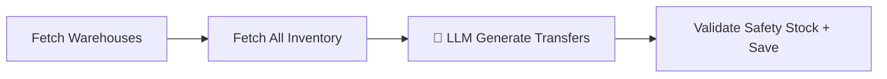

# Warehouse Optimization (AI Agent)

> [!info] At a glance
> `warehouseOptimizationAgent` analyzes capacity utilization across all warehouses and generates 3-5 inter-warehouse transfer recommendations. Strictly enforces safety stock constraints — will never deplete a source below safety level.

---

## 👤 User Level

1. Warehouse manager visits `/dashboard/warehouse/transfers`
2. Clicks **Run Optimization** button (or triggered via Agent Hub)
3. Spinner + progress banner: *"AI analyzing 5 warehouses and 60 inventory items..."* (~25 seconds)
4. Results panel shows:
   - Summary: *"3 transfers recommended. Predicted 12% cost reduction, 15% capacity improvement."*
   - Table of transfers: Product SKU → From WH → To WH, Quantity, Reason
5. User can click **Accept** or **Reject** for each recommendation
6. Accepted transfers update warehouse utilization; rejected ones are marked for AI retraining feedback

---

## 💻 Code / Service Level

### Workflow (4 steps)



### Files

| File | Role |
|------|------|
| `ai/src/mastra/workflows/warehouse-optimization-workflow.ts` | 4-step workflow |
| `ai/src/mastra/agents/warehouse-optimization-agent.ts` | The `warehouseOptimizationAgent` |
| `ai/src/mastra/tools/warehouse-optimization-tools.ts` | fetchWarehouses, fetchInventoryData, calculateDistance |
| `backend/src/modules/warehouse-optimization/model.ts` | `WarehouseOptimizationRecommendation` schema |
| `frontend/src/app/dashboard/warehouse/transfers/page.tsx` | UI for accepting/rejecting |

### Agent strategy

The agent looks for:
1. **Overstocked warehouses** (>80% capacity)
2. **Understocked warehouses** (<60% capacity)
3. **Imbalanced products** (one product concentrated in one warehouse)
4. **Geographic distribution** gaps

It ranks transfers by:
- Impact (large capacity swing)
- Cost (distance-based)
- Safety (never violate safety stock)

### Safety stock enforcement

```typescript
// From warehouse-optimization-workflow.ts (saveRecommendationsStep)
const maxTransfer = Math.max(0, product.availableStock - product.safetyStock);
const validQuantity = Math.min(rec.quantity, maxTransfer);
if (validQuantity <= 0) {
  console.warn(`Skipping: insufficient stock for transfer`);
  continue;
}
```

This is a **deterministic safeguard** applied *after* the LLM output — even if the LLM hallucinates a bad transfer, the math rejects it.

### Output

```json
{
  "generatedAt": "2026-04-11T10:30:00Z",
  "warehousesAnalysed": ["WH-MUM", "WH-BLR", "WH-DEL", "WH-KOL", "WH-CHN"],
  "transferRecommendations": [
    {
      "product": "69d88...",
      "fromWarehouse": "69d8a...",
      "toWarehouse": "69d8b...",
      "quantity": 25,
      "reason": "Mumbai is at 92% capacity, Bangalore at 45%. Moving Ring Binders frees 10% space in Mumbai."
    }
  ],
  "reallocationSummary": "3 transfers rebalance capacity across 5 warehouses",
  "predictedLogisticsCostReductionPercent": 12,
  "predictedCapacityUtilizationImprovement": 15,
  "status": "pending"
}
```

---

## 🔗 Linked Flows

- Prerequisite: [[Create Warehouse]] × 2+, [[Create Product]]
- Related: [[Demand Forecast]] (forecast data informs which products are moving fast)
- After accept: [[Warehouse Transfers]] page shows the accepted transfers to execute

← back to [[README|Flow Index]]
