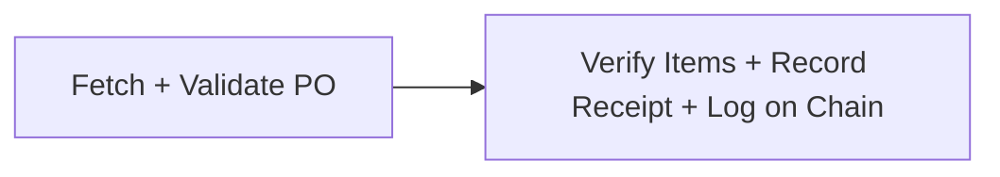
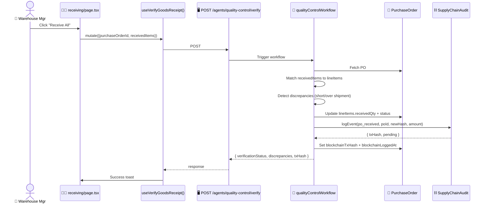
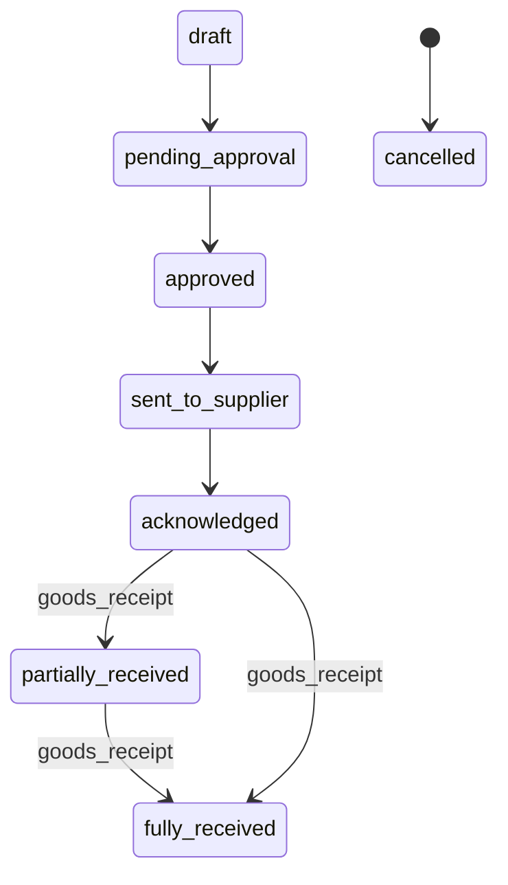

# Goods Receiving (+ Blockchain)

> [!info] At a glance
> Warehouse manager receives a physical shipment against a PO. The `qualityControlAgent` verifies items, records receipt quantities, and logs the event on-chain as `po_received`. The PO's status updates to `fully_received` or `partially_received`.

---

## 👤 User Level

1. Warehouse manager visits `/dashboard/warehouse/receiving`
2. Sees a list of POs in status `sent_to_supplier` / `acknowledged` / `partially_received`
3. For each PO card:
   - PO number, supplier name, warehouse, total amount
   - Pending line items: `SKU: quantity pending`
4. Clicks **Receive All** (or in future, a detailed per-item receipt form)
5. Button shows spinner: *"Verifying..."* (~5 seconds)
6. 📧 Toast: *"Goods receipt verified and logged to blockchain"*
7. PO moves out of the pending list (now `fully_received`)
8. Admin can click the PO's "On-chain ✓" badge to see the Etherscan tx

---

## 💻 Code / Service Level

### Workflow (2 steps)



### Sequence



### Files

| File | Role |
|------|------|
| `frontend/src/app/dashboard/warehouse/receiving/page.tsx` | UI with Receive button |
| `frontend/src/hooks/queries/use-agents.ts` → `useVerifyGoodsReceipt` | Mutation |
| `backend/src/modules/agents/agent.routes.ts` → `/quality-control/verify` | Proxy to Mastra |
| `ai/src/mastra/workflows/quality-control-workflow.ts` | 2-step workflow |
| `ai/src/mastra/agents/quality-control-agent.ts` | LLM agent |
| `ai/src/mastra/tools/quality-control-tools.ts` | Verification + blockchain tools |

### Discrepancy handling

```typescript
// From quality-control-workflow.ts
if (diff < 0) {
  discrepancies.push({ type: 'short_shipment', ... });
} else if (diff > expectedRemaining * 0.05) {
  discrepancies.push({ type: 'over_shipment', ... });  // >5% tolerance
}
if (received.qualityStatus === 'rejected') {
  discrepancies.push({ type: 'quality_rejected', reason });
}
```

### PO status state machine



### Blockchain log created

```typescript
{
  eventType: 'po_received',
  referenceModel: 'PurchaseOrder',
  referenceId: poId,
  payload: {
    poNumber,
    supplierId,
    receivedAt,
    itemsReceived,
    discrepancies,
    overallAccuracy,
    onTimeDelivery
  },
  txHash: '0x...',  // real Sepolia tx
  confirmationStatus: 'pending'  // worker will confirm within 30s
}
```

### Overall accuracy calculation

```
overallAccuracy = (receivedCorrect / totalOrdered) × 100
```

Example:
- Ordered: 100 units
- Received: 95 units, no rejections → 95% accuracy
- Verification status: "partial" (90%+ → partial, 100% → passed)

---

## 🔗 Linked Flows

- Prerequisite: An existing PO from [[Negotiation Two-Agent]] or manual creation
- Triggers: [[On-chain Event Logging]] for `po_received`
- Post-receipt: QR verify from [[QR Verification Flow]] proves the PO wasn't tampered with

← back to [[README|Flow Index]]
