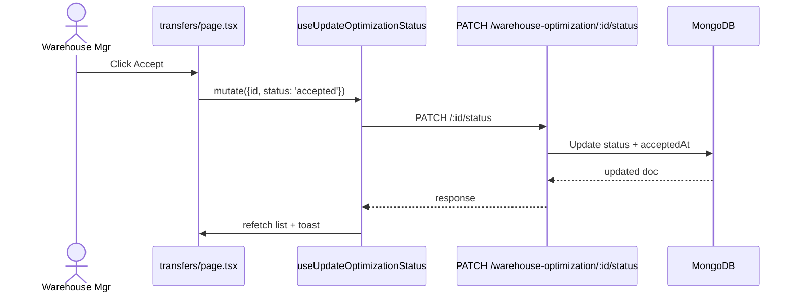
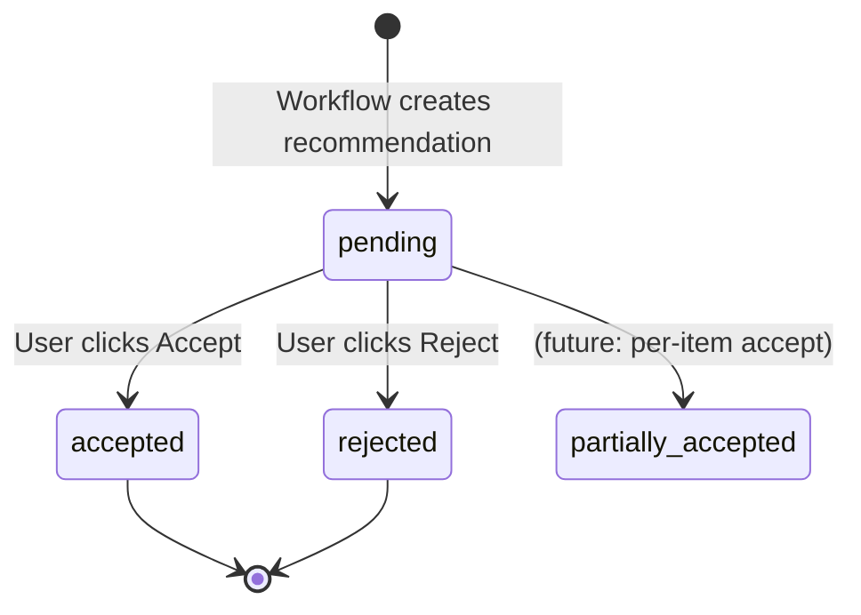

# Warehouse Transfers

> [!info] At a glance
> Execute accepted transfer recommendations from [[Warehouse Optimization]]. This is the "commit" step — clicking Accept on a recommendation updates `WarehouseOptimizationRecommendation.status` and (in production) would trigger physical logistics.

---

## 👤 User Level

1. Warehouse manager visits `/dashboard/warehouse/transfers`
2. Sees a list of optimization runs, most recent first
3. Each card shows:
   - Date + number of transfers
   - Badge: `pending` / `accepted` / `rejected`
   - Predicted cost reduction %, capacity improvement %
   - Detail list of transfers: `[SKU] FromWH → ToWH, qty`
4. For `pending` runs: **Accept** and **Reject** buttons
5. Click **Accept** → updates status, triggers physical movement (future: integrates with shipping API)
6. Click **Reject** → AI gets feedback signal for model improvement

---

## 💻 Code / Service Level

### Files

| File | Role |
|------|------|
| `frontend/src/app/dashboard/warehouse/transfers/page.tsx` | Transfer list with accept/reject |
| `frontend/src/hooks/queries/use-optimization.ts` | `useAllOptimizations`, `useUpdateOptimizationStatus` |
| `frontend/src/lib/api/services/optimization.service.ts` | Axios to `/api/warehouse-optimization` |
| `backend/src/modules/warehouse-optimization/controller.ts` | CRUD + status update |

### Status update flow



### Status transitions



### Data displayed

Each transfer from the recommendation:
```json
{
  "product": { "_id": "...", "name": "Ring Binder A4", "sku": "FIL-BINDER-001" },
  "fromWarehouse": { "_id": "...", "name": "Mumbai Hub", "code": "WHMUM" },
  "toWarehouse": { "_id": "...", "name": "Bangalore Hub", "code": "WHBLR" },
  "quantity": 25,
  "reason": "Mumbai at 92% capacity, Bangalore at 45%. Transfer frees 10% space."
}
```

---

## 🔗 Linked Flows

- Created by: [[Warehouse Optimization]] (AI agent generates the recommendations)
- Related: [[Goods Receiving]] (uses similar PO status tracking pattern)

← back to [[README|Flow Index]]
