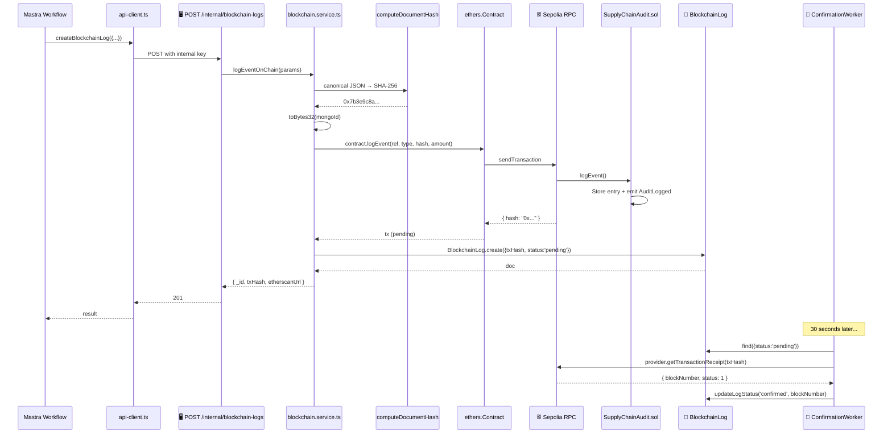

# On-chain Event Logging

> [!info] At a glance
> How a supply chain event (PO created, goods received, etc.) becomes a real immutable record on Ethereum Sepolia. Includes async submission pattern so workflows don't block.

> [!tip] New to blockchain?
> Read [[_Blockchain Explainer]] first for the concepts.

---

## 👤 User Level

This flow is **mostly invisible to end users**. It runs transparently whenever:

- A Purchase Order is created via [[Negotiation Two-Agent]]
- Goods are received via [[Goods Receiving]]
- A negotiation is accepted or rejected

Users see the result as a small **"On-chain ✓"** badge on the PO row, which links to the Etherscan transaction.

Admins can watch all events in real-time on `/dashboard/admin/analytics` or the Agent Hub.

---

## 💻 Code / Service Level

### Sequence (full path)



### Files

| File | Role |
|------|------|
| `blockchain/contracts/SupplyChainAudit.sol` | The on-chain program |
| `blockchain/scripts/deploy.ts` | One-time deployment script |
| `backend/src/modules/blockchain/service.ts` | ethers.js wrapper, `logEventOnChain`, `computeDocumentHash` |
| `backend/src/modules/blockchain/worker.ts` | node-cron polling every 30s |
| `backend/src/modules/blockchain/routes.ts` | HTTP routes |
| `backend/src/modules/blockchain/controller.ts` | Request handlers |
| `backend/src/modules/blockchain/constants.ts` | Event enum, ABI loader |
| `backend/src/modules/internal/internal.routes.ts` | `/api/internal/blockchain-logs` delegates to service |
| `ai/src/mastra/api-client.ts` → `createBlockchainLog` | Mastra's entry point |

### Why the async pattern matters

**Naive approach (blocking):**
```typescript
const tx = await contract.logEvent(...);
await tx.wait();  // blocks for 15-60 seconds
return tx;
```

This would make every Mastra workflow that writes a PO wait 15-60 seconds for chain confirmation — unacceptable UX.

**Our approach (non-blocking):**
```typescript
const tx = await contract.logEvent(...);  // returns ~400ms, just submits to mempool
// NO await tx.wait()
await BlockchainLog.create({ txHash: tx.hash, status: 'pending' });
return { txHash, status: 'pending' };  // return immediately
```

Then a background `ConfirmationWorker` runs every 30 seconds:
```typescript
const pending = await BlockchainLog.find({ status: 'pending' });
for (const log of pending) {
  const receipt = await provider.getTransactionReceipt(log.txHash);
  if (receipt?.status === 1) {
    await log.updateOne({ status: 'confirmed', blockNumber: receipt.blockNumber });
  }
}
```

User experience: workflow completes in 100ms. A few seconds later the "pending" badge turns into "confirmed" via React Query polling on the frontend.

### What actually goes on-chain

Only 6 values, totaling ~200 bytes:

```solidity
struct AuditEntry {
    bytes32 referenceId;    // 32 bytes — MongoDB ObjectId padded
    uint8 eventType;         // 1 byte — enum 0-7
    bytes32 documentHash;    // 32 bytes — SHA-256 fingerprint
    uint256 amount;          // 32 bytes — paise (₹×100)
    uint256 timestamp;       // 32 bytes — block.timestamp
    address submittedBy;     // 20 bytes — backend wallet
}
```

### Event emitted (for indexing)

```solidity
event AuditLogged(
    bytes32 indexed referenceId,
    uint8 indexed eventType,
    bytes32 documentHash,
    uint256 amount,
    uint256 timestamp,
    address indexed submittedBy
);
```

The `indexed` modifier means subgraphs (The Graph, Covalent, etc.) can efficiently query by referenceId or eventType.

### Fallback mode

If `SEPOLIA_RPC_URL` / `DEPLOYER_PRIVATE_KEY` / `SUPPLY_CHAIN_CONTRACT_ADDRESS` are not set in `backend/.env`, the service falls back to **offline mode**: it still computes the SHA-256 hash and saves to MongoDB, but skips the chain submission. `confirmationStatus` is set to `'confirmed'` immediately and `networkName: 'offline-fallback'`.

This is **important for demos**: the whole system works without ever touching a real blockchain. Enable real mode by adding the 3 env vars.

### Measured performance

| Metric | Offline mode | Real Sepolia |
|--------|-------------:|-------------:|
| Write latency (mean) | 49 ms | ~400 ms |
| Write latency P95 | 58 ms | ~700 ms |
| Confirmation | Instant | ~30 s |
| Cost | Free | ~$0.0003/tx |

---

## 🔗 Linked Flows

- Called by: [[Negotiation Two-Agent]], [[Goods Receiving]]
- Verified by: [[QR Verification Flow]]
- Explained in: [[_Blockchain Explainer]]
- Test: [[Tamper Detection]]

← back to [[README|Flow Index]]
