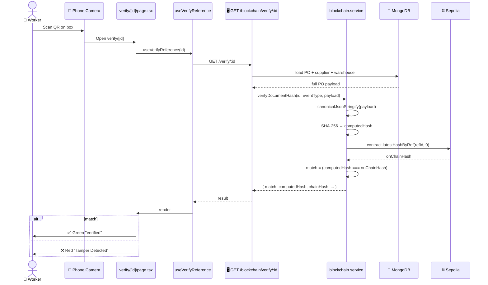

# QR Verification Flow (Dock Scan)

> [!info] At a glance
> A warehouse worker scans the QR code on a shipping box. The verify page loads the current PO from MongoDB, recomputes the SHA-256 hash, calls the smart contract's `verifyHash()`, and shows ✅ (match) or ❌ (tamper).

> [!tip] This is the payoff
> Everything in [[On-chain Event Logging]] exists to make this single verification trustless. Anyone — even a government auditor — can verify a PO wasn't tampered with, without trusting our database.

---

## 👤 User Level

**Scenario:** A truck arrives at the warehouse with 100 ring binders. The shipping label has a QR code printed on it.

1. Warehouse worker opens phone camera
2. Points at QR code on the box
3. Camera detects URL: `http://localhost:3000/verify/69d88ae76e53869074a167b6?type=po_created`
4. Phone opens that URL in browser
5. Page loads (no login required)
6. Shows either:
   - ✅ **Big green card:** "Verified — This document is unaltered since it was recorded on-chain"
   - ❌ **Big red card:** "Tamper Detected — WARNING: The document has been modified. Halt payment settlement immediately"
7. Below the verdict, sees:
   - PO details (poNumber, supplier, amount in ₹)
   - Computed hash (from current DB)
   - On-chain hash (from Sepolia)
   - Link to Etherscan tx
   - Full audit history (PO_CREATED → PO_APPROVED → PO_RECEIVED...)

---

## 💻 Code / Service Level

### Sequence



### Files

| File | Role |
|------|------|
| `backend/src/modules/qr/qr.service.ts` | Generates QR codes with verify URL |
| `backend/src/modules/qr/qr.routes.ts` | GET `/api/qr/po/:id` |
| `backend/src/modules/blockchain/controller.ts` → `verifyByReference` | Public verify endpoint |
| `backend/src/modules/blockchain/service.ts` → `verifyDocumentHash` | Hash comparison logic |
| `frontend/src/app/verify/layout.tsx` | Public layout (no auth required) |
| `frontend/src/app/verify/[referenceId]/page.tsx` | Verify UI with ✅/❌ |
| `frontend/src/components/features/blockchain/qr-modal.tsx` | QR generator modal on PO table |

### QR code content

The QR encodes a URL like:
```
http://localhost:3000/verify/69d88ae76e53869074a167b6?type=po_created
```

In production this would be:
```
https://app.autostock.ai/verify/69d88ae76e53869074a167b6?type=po_created
```

The URL goes to a **public page** (no login required) so any stakeholder — warehouse worker, auditor, customer — can verify independently.

### Canonical JSON — why it matters

The hash must be **deterministic**. `JSON.stringify({a:1,b:2})` and `JSON.stringify({b:2,a:1})` produce different strings, therefore different hashes. We use a canonical serializer:

```typescript
function canonicalJsonStringify(obj: unknown): string {
  if (obj === null || typeof obj !== 'object') return JSON.stringify(obj);
  if (Array.isArray(obj)) return `[${obj.map(canonicalJsonStringify).join(',')}]`;
  const keys = Object.keys(obj as object).sort();  // ← sorted keys
  return `{${keys.map(k => `${JSON.stringify(k)}:${canonicalJsonStringify((obj as any)[k])}`).join(',')}}`;
}
```

This ensures the same PO always produces the same hash, regardless of how Mongoose or JavaScript ordered the object's keys.

### The actual verification logic

```typescript
// backend/src/modules/blockchain/service.ts
export async function verifyDocumentHash(params) {
  const computedHash = computeDocumentHash(params.payload);
  const eventTypeUint = EVENT_TYPE_ENUM[params.eventType];

  // Query the contract directly
  const contract = getContract();
  const refBytes32 = toBytes32(params.referenceId);
  const chainHash = await contract.latestHashByRef(refBytes32, eventTypeUint);

  return {
    match: chainHash.toLowerCase() === computedHash.toLowerCase(),
    computedHash,
    chainHash,
    // ... supporting info
  };
}
```

### Backend public route

```typescript
// backend/src/modules/blockchain/routes.ts
router.get('/verify/:referenceId', verifyByReference);  // NO authenticate middleware
```

> [!warning] No auth on verify endpoint
> This is **intentional**. The whole point of blockchain verification is that anyone should be able to verify without needing credentials. The endpoint only reveals the hash comparison result, not sensitive data (unless `?includePayload=true` is passed).

---

## 🔗 Linked Flows

- Prerequisite: PO must have had [[On-chain Event Logging]] fire at creation
- Related: [[Goods Receiving]] triggers a second on-chain log at receipt
- Test: [[Tamper Detection]]

← back to [[README|Flow Index]]
