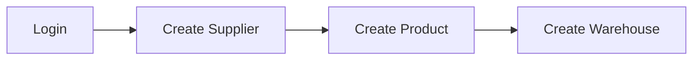
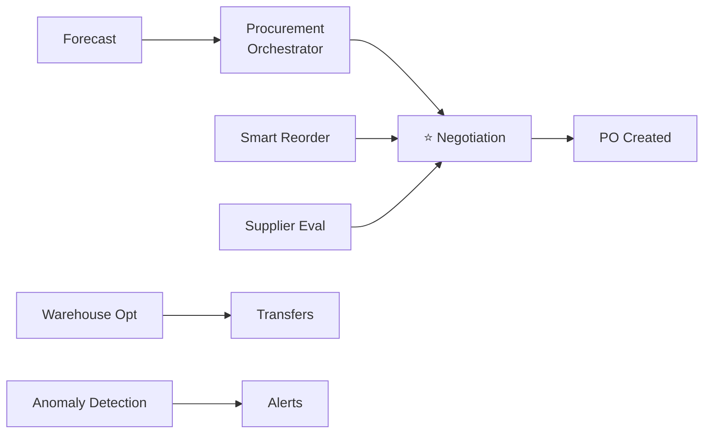
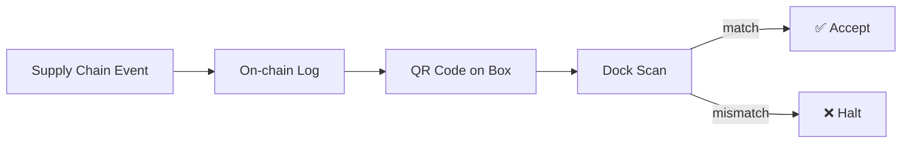
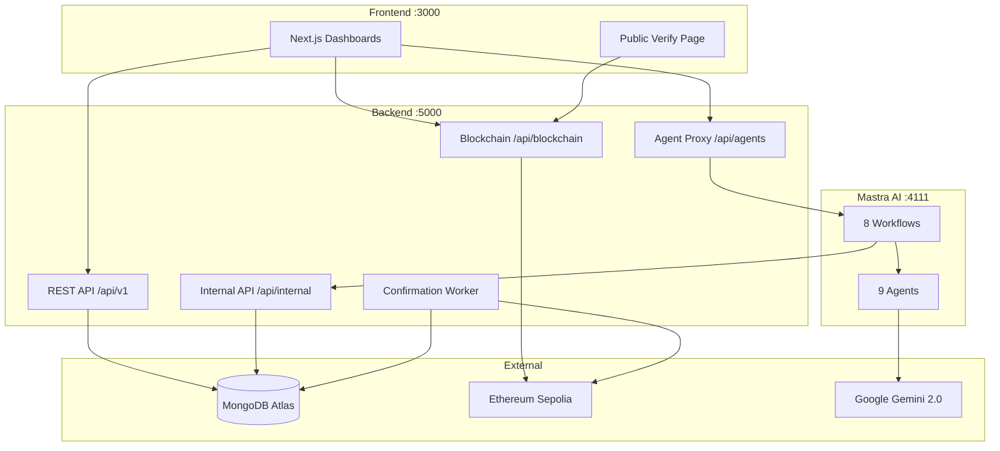

# AutoStock AI — Flow Explorer

> [!tip] How to use this vault
> 1. Open this folder in Obsidian (`File → Open folder as vault`)
> 2. Open **`AutoStock.canvas`** first for a visual map of the whole system
> 3. Follow the journey below, or use **Graph View** (Ctrl/Cmd + G) to see interconnections
> 4. Each flow has two views: **👤 User Level** and **💻 Code Level**

---

## 🗺️ Visual Map

🎨 **[[AutoStock.canvas|Open Canvas View]]** — interactive whiteboard of all flows and their connections

---

## 📖 Essential Reading

> [!warning] Read this first if you're new to blockchain
> [[_Blockchain Explainer]] — Plain-English guide (Parts 1-10). No prior blockchain knowledge required.

---

## 🚀 The User Journey

Follow the flows in this order to understand the system end-to-end:

### Phase 1 — Foundations (Auth & Setup)

- 🔐 [[Login]] — Sign in → get JWT → redirect to role dashboard
- 🔐 [[Signup]] — Create new account with role
- 🔐 [[Forgot Password]] — Password reset stub
- 👑 [[Create Supplier]] — **Critical** — enables the entire agentic chain
- 👑 [[Create Product]] — With supplier dropdown from DB
- 👑 [[Create Warehouse]] — Location + capacity tracking

### Phase 2 — The Autonomous Procurement Chain (7 AI agents)

- 📈 [[Demand Forecast]] — 90-day history → 7-day forecast (daily cron)
- 🏭 [[Warehouse Optimization]] — Inter-warehouse transfer recommendations
- 📊 [[Procurement Orchestrator]] — Stock vs ROP + EOQ calculation
- 🔁 [[Smart Reorder]] — Batch reorder plan across all products
- ⭐ [[Negotiation Two-Agent]] — **Flagship** — Priya ↔ Rajesh dialogue
- ⭐ [[Supplier Evaluation]] — SRI scoring (0.35·OnTime + 0.25·Quality + 0.25·Price + 0.15·Responsiveness)
- 🚨 [[Anomaly Detection]] — Real-time fraud/stockout/capacity scanning

### Phase 3 — Warehouse Operations

- 📦 [[Goods Receiving]] — Dock receipt + Quality Control agent + blockchain log
- 🔀 [[Warehouse Transfers]] — Execute accepted optimization recommendations

### Phase 4 — The Trust Layer (Blockchain)

- ⛓️ [[On-chain Event Logging]] — How events become immutable records
- 📱 [[QR Verification Flow]] — Dock scan flow
- 🔒 [[Tamper Detection]] — Adversarial test showing the security guarantee

---

## 📂 Flows Directory

| Category | Flows | Critical Flow |
|----------|-------|:-------------:|
| **🔐 Foundations (Auth)** | [[Login]] · [[Signup]] · [[Forgot Password]] | [[Login]] |
| **👑 System Setup (Admin CRUD)** | [[Create Supplier]] · [[Create Product]] · [[Create Warehouse]] | [[Create Supplier]] |
| **🤖 Autonomous Procurement** | [[Demand Forecast]] · [[Warehouse Optimization]] · [[Procurement Orchestrator]] · [[Smart Reorder]] · [[Negotiation Two-Agent]] · [[Supplier Evaluation]] · [[Anomaly Detection]] | [[Negotiation Two-Agent]] |
| **🏭 Warehouse Ops** | [[Goods Receiving]] · [[Warehouse Transfers]] | [[Goods Receiving]] |
| **⛓️ Trust Layer** | [[On-chain Event Logging]] · [[QR Verification Flow]] · [[Tamper Detection]] | [[On-chain Event Logging]] |

---

## 🏗️ System Architecture

---

## 🎯 Quick Reference

### If you want to...

| Goal | Start here |
|------|-----------|
| **Demo the system end-to-end** | [[Login]] → [[Create Supplier]] → [[Negotiation Two-Agent]] |
| **Understand blockchain** | [[_Blockchain Explainer]] |
| **See how AI agents work** | [[Negotiation Two-Agent]] (the flagship) |
| **Verify a PO manually** | [[QR Verification Flow]] |
| **Test tamper detection** | [[Tamper Detection]] |
| **Set up Sepolia from scratch** | `../BLOCKCHAIN_SETUP.md` |

### Stats

- **20** flow files total
- **8** Mastra workflows covered
- **9** AI agents documented
- **3-level detail** in each flow: User Level, Code Level, API Trace

---

## 🔍 Legend

Used throughout the flow files:

| Icon | Meaning |
|:---:|---------|
| 👤 | User action (click, type, scan) |
| 🧑‍💻 | Frontend code |
| 🖥️ | Backend code |
| 🤖 | Mastra AI code |
| 💾 | MongoDB write/read |
| ⛓️ | Ethereum transaction |
| 🧠 | LLM call (Gemini) |
| 📧 | User-visible result (toast, page, email) |
| ⭐ | Flagship feature |

---

*Last updated: 2026-04-11*
*Project: AutoStock AI — Autonomous Supply Chain Platform*
*For external reviewers: start with [[_Blockchain Explainer]] and [[Negotiation Two-Agent]]*
