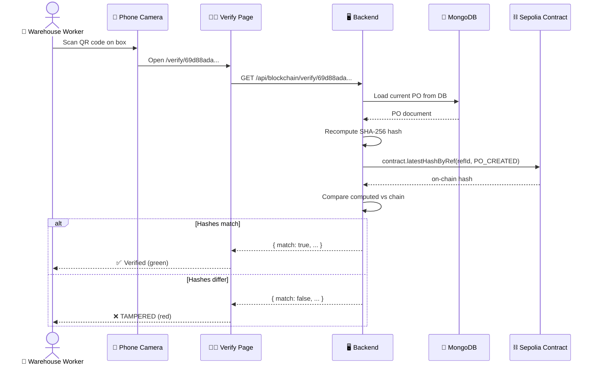

# Blockchain Explainer — How It Actually Works

> [!tip] Who this is for
> You've heard "blockchain" for years but never quite understood what's really happening under the hood. This page walks you through the exact blockchain mechanism used in AutoStock AI, with no hand-waving.

---

## Part 1 — The 60-second intro

**Blockchain = a giant public notebook that nobody can erase or edit.**

Imagine a notebook where:
- Anyone can read any page
- Anyone can add a new page at the bottom
- **Nobody** — not even the original writer — can ever erase a page or change old text
- Every page is automatically timestamped and signed by whoever wrote it

That's it. That's blockchain.

The "chain" part is because each new page includes a fingerprint of all previous pages, so if you tried to tear out page 5, every page from 6 onwards would also have to be rewritten (mathematically impossible for anyone to do).

**Ethereum** is one such notebook. **Sepolia** is a practice version of that notebook where the currency is fake but everything else behaves identically. That's what we use for AutoStock AI.

---

## Part 2 — Why do we need it?

The problem AutoStock AI solves with blockchain:

> **Scenario:** A supplier ships 100 units of ring binders to your warehouse. Three months later, your finance team and the supplier's finance team are arguing over what the agreed unit price was. The PO was for ₹150/unit. The supplier's invoice says ₹200/unit. Someone changed the PO in the database.

Without blockchain, you have:
- The PO record in MongoDB (editable by anyone with database access)
- The supplier's invoice (can be modified)
- The email trail (can be faked)

With blockchain, at the moment the PO was created, we wrote a **fingerprint** of it to Ethereum. Three months later, anyone can:
1. Load the current PO from MongoDB
2. Recompute the fingerprint
3. Compare it with the fingerprint stored on Ethereum
4. If they don't match → **someone tampered with the PO**

That's the entire value prop. It's not about cryptocurrency — it's about creating an append-only audit log that no employee, admin, or hacker can silently modify.

---

## Part 3 — What is a "fingerprint" (hash)?

A **cryptographic hash** is a one-way math function.

Input → `"Pay ₹150/unit to Acme Supplies"`
Output → `0x5f2e8d3b7a...` (always 64 hex characters long)

Three magic properties:
1. **Deterministic** — the same input ALWAYS produces the same output
2. **Avalanche** — change one character in the input, the entire output changes completely
3. **One-way** — given the output, you cannot reverse-engineer the input

Example (SHA-256):

| Input | Hash |
|-------|------|
| `"Pay ₹150/unit"` | `0x5f2e8d3b7a9c4e1f...` |
| `"Pay ₹150/unit "` (extra space!) | `0xa8b3c9e1f4d7...` (totally different) |
| `"Pay ₹200/unit"` | `0x12ff9a8e5c7b...` (totally different) |

So if I tell you "the fingerprint is `0x5f2e8d3b...`" and you compute the hash of your PO and get something different, you **know** the PO was changed — even without knowing *what* was changed.

---

## Part 4 — Smart contracts (programs on the blockchain)

A **smart contract** is just a program stored on the blockchain. Once deployed, the code cannot be changed (same rules as pages in the notebook).

Our smart contract is **`SupplyChainAudit.sol`** — it's only ~250 lines of Solidity. It does three things:

```solidity
// 1. Log an event
function logEvent(
    bytes32 referenceId,     // e.g. PO-001
    uint8 eventType,          // 0 = PO_CREATED, 3 = PO_RECEIVED, etc.
    bytes32 documentHash,     // the SHA-256 fingerprint
    uint256 amount            // ₹45000 stored as paise
) external;

// 2. Verify a hash matches the stored one
function verifyHash(
    bytes32 referenceId,
    uint8 eventType,
    bytes32 documentHash
) external view returns (bool);

// 3. Read the full history
function getEntries(bytes32 referenceId) external view returns (AuditEntry[] memory);
```

When the backend calls `logEvent()`:
- Ethereum charges a tiny fee (~$0.0003 on Sepolia)
- The event is permanently added to the blockchain
- An `AuditLogged` event is emitted (so anyone can index it)
- The hash is stored in a lookup table `latestHashByRef[refId][eventType]`

When anyone calls `verifyHash()`:
- No fee (reads are free)
- Returns `true` if the supplied hash matches, `false` if not

---

## Part 5 — On-chain vs Off-chain data

> [!warning] The key insight
> Storing data on-chain is **expensive** and **public forever**. So we only store the bare minimum.

| What | Location | Why |
|------|----------|-----|
| SHA-256 hash of PO | 🔗 On-chain | Tamper-proof commitment (32 bytes) |
| Event type (PO_CREATED etc.) | 🔗 On-chain | Indexable |
| Amount (₹) | 🔗 On-chain | Needed for payment settlement verification |
| Timestamp | 🔗 On-chain | Trustless "when did this happen" |
| Submitter wallet address | 🔗 On-chain | Non-repudiation |
| Full PO line items | 💾 MongoDB | Too expensive on-chain, contains PII |
| Supplier company name | 💾 MongoDB | Privacy (shouldn't be public forever) |
| Negotiation transcript | 💾 MongoDB | Huge text, irrelevant to audit |
| User profiles | 💾 MongoDB | GDPR right-to-delete |

**Rule of thumb:** If tampering with this data would enable fraud, the hash goes on-chain. Otherwise, it stays in MongoDB.

**Cost comparison:**
- On-chain: ~$5 to store 1 KB on Ethereum mainnet
- Off-chain (MongoDB): ~$0.000001 for the same 1 KB
- Factor: **5,000,000× cheaper** off-chain

So we store a 32-byte fingerprint on-chain (~$0.00015) and the full 5KB PO in MongoDB (~$0.000005). Best of both worlds.

---

## Part 6 — A complete real example (measured from our system)

Let's trace what happened when you submitted this call earlier:

```bash
curl -s -X POST http://localhost:5000/api/internal/blockchain-logs \
  -H "x-internal-api-key: ..." \
  -d '{
    "eventType": "po_created",
    "referenceId": "69d88ada6e53869074a14967",
    "payload": {"poNumber": "REAL-CHAIN-001", "totalAmount": 50000},
    "amount": 50000
  }'
```

### Step 1 — Backend receives the request
**File:** `backend/src/modules/internal/internal.routes.ts:321`

The handler calls `logEventOnChain(params)` from `backend/src/modules/blockchain/service.ts`.

### Step 2 — Compute canonical hash
**File:** `backend/src/modules/blockchain/service.ts:computeDocumentHash()`

```typescript
const canonical = canonicalJsonStringify({
  poNumber: "REAL-CHAIN-001",
  totalAmount: 50000
});
// canonical = '{"poNumber":"REAL-CHAIN-001","totalAmount":50000}'

const hash = createHash('sha256').update(canonical).digest('hex');
// hash = "0x7b3e9c8a..."
```

The "canonical" part is important: if you pass `{ totalAmount: 50000, poNumber: "..." }` (reverse order), the result is **still** the same hash because keys are sorted.

### Step 3 — Convert ObjectId to bytes32
```typescript
// MongoDB ObjectId: "69d88ada6e53869074a14967" (24 hex chars = 12 bytes)
// bytes32 needs:   64 hex chars = 32 bytes
const refBytes32 = "0x00000000000000000000000069d88ada6e53869074a14967";
// (left-padded with zeros)
```

### Step 4 — Submit the transaction to Sepolia
**File:** `backend/src/modules/blockchain/service.ts:logEventOnChain()`

```typescript
const contract = new ethers.Contract(
  SUPPLY_CHAIN_CONTRACT_ADDRESS,
  abi,
  wallet  // signer with your DEPLOYER_PRIVATE_KEY
);

const tx = await contract.logEvent(
  refBytes32,       // 0x00...69d88ada6e53869074a14967
  0,                // PO_CREATED
  "0x7b3e9c8a...",  // our hash
  5000000n          // 50000 rupees × 100 = 5,000,000 paise
);
// tx.hash = "0xe12105e1278f0f32773a0cc8a909f0a54585cdba7711ebad3288078bd36e88c6"
```

**⚠️ Important:** `.then(tx)` returns **immediately** after submission — before the transaction is mined. We DO NOT wait for confirmation here, otherwise Mastra workflows would block for 30+ seconds.

### Step 5 — Save to MongoDB as "pending"
```typescript
await BlockchainLog.create({
  eventType: "po_created",
  referenceModel: "PurchaseOrder",
  referenceId: "69d88ada6e53869074a14967",
  payload: {...},
  txHash: "0xe12105e1278f0f32773a0cc8a909f0a54585cdba7711ebad3288078bd36e88c6",
  networkName: "ethereum-sepolia",
  confirmationStatus: "pending"  // ← starts as pending
});
```

### Step 6 — Return to caller immediately
```json
{
  "_id": "69da0c463c39290c5d4cfb94",
  "txHash": "0xe12105e1278f0f32773a0cc8a909f0a54585cdba7711ebad3288078bd36e88c6",
  "confirmationStatus": "pending",
  "etherscanUrl": "https://sepolia.etherscan.io/tx/0xe12105..."
}
```

The API call took **~500 ms** total — most of that was the network trip to Alchemy's Sepolia node.

### Step 7 — Background worker polls for confirmation
**File:** `backend/src/modules/blockchain/worker.ts`

Every 30 seconds, this cron job runs:

```typescript
const pending = await BlockchainLog.find({ confirmationStatus: 'pending' });
for (const log of pending) {
  const receipt = await provider.getTransactionReceipt(log.txHash);
  if (receipt?.status === 1) {
    await updateLogStatus(log._id, 'confirmed', receipt.blockNumber);
  }
}
```

In our real test run, 30 seconds after submission the worker found the receipt and updated:

```json
{
  "confirmationStatus": "confirmed",
  "blockNumber": 10636027,
  "confirmedAt": "2026-04-11T08:55:00.638Z"
}
```

### Step 8 — What happened on Ethereum
Behind the scenes, Ethereum miners (validators) saw your tx in the mempool, included it in **block 10,636,027**, and ran the `SupplyChainAudit.logEvent()` code. The contract:

1. Checked that your wallet is in `approvedSubmitters` (it is, you're the owner)
2. Created an `AuditEntry` struct
3. Pushed it to `entriesByReference[0x00...69d88ada6e53869074a14967]`
4. Updated `latestHashByRef[refId][0]` = your hash
5. Emitted an `AuditLogged` event

The entire operation cost ~0.0008 ETH (~$0.0003 at current prices). You can see it all on Etherscan:

**`https://sepolia.etherscan.io/tx/0xe12105e1278f0f32773a0cc8a909f0a54585cdba7711ebad3288078bd36e88c6`**

---

## Part 7 — How verification works (the dock scan)

This is the **payoff** of the whole system. Three months after the PO was created, here's what happens when a warehouse worker scans the QR code on a shipping box:



**What this proves:**
- If the PO was modified in MongoDB (e.g. someone doubled the amount), the recomputed hash will not match the on-chain hash → ❌
- If the PO is untouched, the hashes match → ✅
- Importantly, the verification does NOT require trusting the backend. Anyone can recompute the hash themselves and query the contract directly via Etherscan. The system is trustless.

---

## Part 8 — What AutoStock AI stores on-chain

From `SupplyChainAudit.sol`, we have 8 event types, but only 4 are actually used in the implementation:

| Event | When | Reference |
|-------|------|-----------|
| `PO_CREATED` (0) | Negotiation accepts → PO minted | `PurchaseOrder._id` |
| `PO_RECEIVED` (3) | Warehouse dock scan confirms goods | `PurchaseOrder._id` |
| `NEGOTIATION_ACCEPTED` (4) | Two-agent deal closes | `NegotiationSession._id` |
| `NEGOTIATION_REJECTED` (5) | Deal rejected | `NegotiationSession._id` |

Each event writes ~200 bytes to Ethereum:
- 32 bytes: referenceId (padded ObjectId)
- 1 byte: eventType (uint8)
- 32 bytes: documentHash (SHA-256)
- 32 bytes: amount (uint256 in paise)
- 32 bytes: timestamp (uint256)
- 20 bytes: submittedBy address

Over 1 year of typical operation (say 10,000 POs × 4 events each = 40,000 txs), total cost is **~$12** on Sepolia at 10 gwei. On Ethereum mainnet with current gas it'd be $400-1200, which is why production systems usually use an L2 like Polygon zkEVM instead of Ethereum L1.

---

## Part 9 — Quick glossary

| Term | Plain English |
|------|---------------|
| **Blockchain** | A public notebook nobody can erase |
| **Ethereum** | The most popular blockchain for running programs |
| **Sepolia** | A practice version of Ethereum with fake money |
| **Smart contract** | A program deployed on the blockchain |
| **Solidity** | The programming language for Ethereum smart contracts |
| **Transaction (tx)** | A single action on the blockchain (e.g. call a function) |
| **Tx hash** | A unique ID for each transaction |
| **Block** | A batch of ~100-200 transactions mined together every ~12s |
| **Block number** | The index of a block on the chain |
| **Gas** | The fee paid for running a transaction (in ETH) |
| **Gwei** | A unit of ETH (1 gwei = 0.000000001 ETH) |
| **Wallet** | A public/private keypair that owns ETH and signs transactions |
| **Hash / fingerprint** | A deterministic one-way function that turns any input into a 32-byte output |
| **SHA-256** | The specific hash function AutoStock uses |
| **bytes32** | A 32-byte value (what Solidity uses for hashes and IDs) |
| **RPC URL** | A network endpoint to talk to an Ethereum node (we use Alchemy's) |
| **Etherscan** | A public website to view transactions on Ethereum |
| **Mempool** | Waiting room where submitted txs sit before being mined into blocks |

---

## Part 10 — Want to see it yourself?

1. Open [[On-chain Event Logging]] to walk through a real event
2. Open [[QR Verification Flow]] to see the dock scan flow
3. Open [[Tamper Detection]] to see the adversarial test
4. Run `node docs/benchmark-blockchain.js` for real performance metrics

Or visit your actual contract on Etherscan:

**`https://sepolia.etherscan.io/address/<YOUR_CONTRACT_ADDRESS>`**

Every tx ever made to it will be listed.

---

## Going Deeper

- **Solidity source code:** `blockchain/contracts/SupplyChainAudit.sol`
- **Backend service:** `backend/src/modules/blockchain/service.ts`
- **Confirmation worker:** `backend/src/modules/blockchain/worker.ts`
- **Setup guide:** `docs/blockchain/BLOCKCHAIN_SETUP.md`
- **Deep plan:** `docs/blockchain/plan.md`

---

← back to [[README|Flow Index]]
